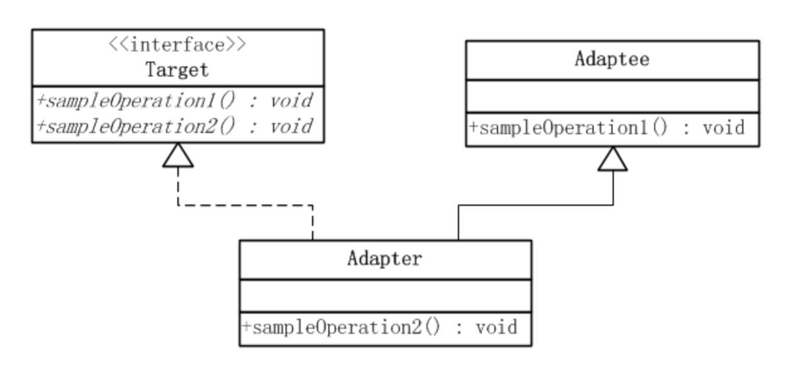

# 适配器模式

适配器模式把一个类的接口变换成客户端所期待的另一种接口，从而使原本因接口不匹配而无法在一起工作的两个类能够在一起工作。

适配器模式有**类的适配器模式**和**对象的适配器模式**两种不同的形式。

**类适配模式**(适配器继承适配者并实现目标接口)

模式所涉及的角色有：

1. 目标(Target)角色：这就是所期待得到的接口。注意：由于这里讨论的是类适配器模式，因此目标不可以是类。

2. 源(Adapee)角色：现在需要适配的接口。

3. 适配器(Adaper)角色：适配器类是本模式的核心。适配器把源接口转换成目标接口。显然，这一角色不可以是接口，而必须是具体类。

需要三个对象存在：目标角色、源角色、适配器角色

**对象适配模式**（采用组合的方式使用适配者方法）

尽量使用对象适配器的实现方式，多用合成/聚合、少用继承。当然，具体问题具体分析，根据需要来选用实现方式，最适合的才是最好的

**适配器模式的优点**
1. 更好的复用性  
　　系统需要使用现有的类，而此类的接口不符合系统的需要。那么通过适配器模式就可以让这些功能得到更好的复用。

2. 更好的扩展性  
　　  在实现适配器功能的时候，可以调用自己开发的功能，从而自然地扩展系统的功能。

**适配器模式的缺点**
1. 过多的使用适配器，会让系统非常零乱，不易整体进行把握。比如，明明看到调用的是A接口，其实内部被适配成了B接口的实现，一个系统如果太多出现这种情况，无异于一场灾难。因此如果不是很有必要，可以不使用适配器，而是直接对系统进行重构。

**缺省适配模式**  
缺省适配(Default Adapter)模式为一个接口提供缺省实现，这样子类型可以从这个缺省实现进行扩展，而不必从原有接口进行扩展。

适配器模式的用意是要改变源的接口，以便于目标接口相容。缺省适配的用意稍有不同，它是为了方便建立一个不平庸的适配器类而提供的一种平庸实现

remark：
即功能已经有了，但是口的大小或者形状不满足要求，只能重新构造一个口了，但是内部的功能不需要重新写，直接调用原有的功能就行。

让咱们适配一把吧。。
