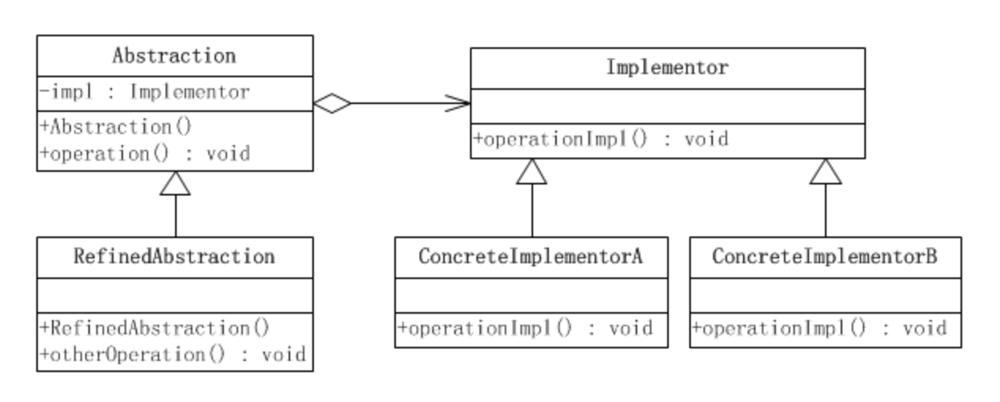
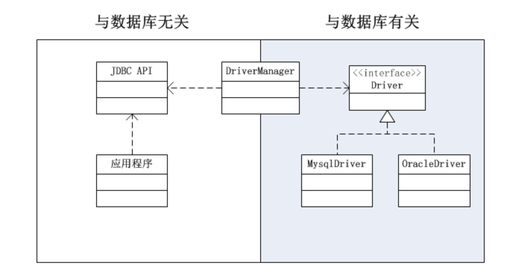

# 桥梁模式

桥梁模式是对象的结构模式。又称为柄体(Handle and Body)模式或接口(Interface)模式。桥梁模式的用意是“将抽象化(Abstraction)与实现化(Implementation)脱耦，使得二者可以独立地变化”。

桥梁模式所涉及的角色有：

1. 抽象化(Abstraction)角色：抽象化给出的定义，并保存一个对实现化对象的引用。

2. 修正抽象化(RefinedAbstraction)角色：扩展抽象化角色，改变和修正父类对抽象化的定义。

3. 实现化(Implementor)角色：这个角色给出实现化角色的接口，但不给出具体的实现。必须指出的是，这个接口不一定和抽象化角色的接口定义相同，实际上，这两个接口可以非常不一样。实现化角色应当只给出底层操作，而抽象化角色应当只给出基于底层操作的更高一层的操作。

4. 具体实现化(ConcreteImplementor)角色：这个角色给出实现化角色接口的具体实现。

在java中的应用：（jdbc的实现）

