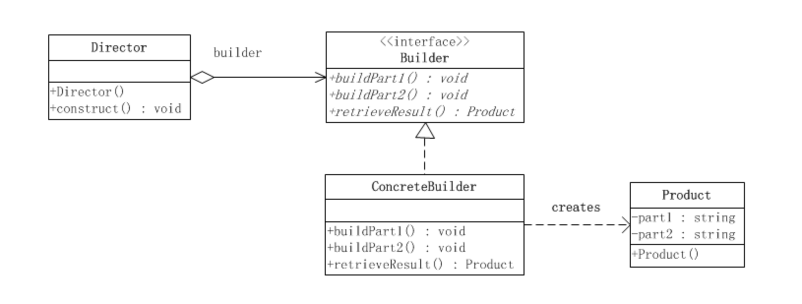

# 建造模式

建造模式是对象的创建模式。建造模式可以将一个产品的内部表象（internal representation）与产品的生产过程分割开来，从而可以使一个建造过程生成具有不同的内部表象的产品对象。

**抽象建造者（Builder）角色**：给 出一个抽象接口，以规范产品对象的各个组成成分的建造。一般而言，此接口独立于应用程序的商业逻辑。模式中直接创建产品对象的是具体建造者 (ConcreteBuilder)角色。具体建造者类必须实现这个接口所要求的两种方法：一种是建造方法(buildPart1和 buildPart2)，另一种是返还结构方法(retrieveResult)。一般来说，产品所包含的零件数目与建造方法的数目相符。换言之，有多少 零件，就有多少相应的建造方法。

**具体建造者（ConcreteBuilder）角色**：担任这个角色的是与应用程序紧密相关的一些类，它们在应用程序调用下创建产品的实例。这个角色要完成的任务包括：1.实现抽象建造者Builder所声明的接口，给出一步一步地完成创建产品实例的操作。2.在建造过程完成后，提供产品的实例。

**导演者（Director）角色**：担任这个角色的类调用具体建造者角色以创建产品对象。应当指出的是，导演者角色并没有产品类的具体知识，真正拥有产品类的具体知识的是具体建造者角色。

**产品（Product）角色**：产品便是建造中的复杂对象。一般来说，一个系统中会有多于一个的产品类，而且这些产品类并不一定有共同的接口，而完全可以是不相关联的。

建造模式都存在这么两个部分，一个部分是部件构造和产品装配，另一个部分是整体构建的算法

**建造者使用场景：**

1. 需要生成的产品对象有复杂的内部结构，每一个内部成分本身可以是对象，也可以仅仅是一个对象（即产品对象）的一个组成部分。

2. 需要生成的产品对象的属性相互依赖。建造模式可以强制实行一种分步骤进行的建造过程，因此，如果产品对象的一个属性必须在另一个属性被赋值之后才可以被赋值，使用建造模式是一个很好的设计思想。

3. 在对象创建过程中会使用到系统中的其他一些对象，这些对象在产品对象的创建过程中不易得到。
