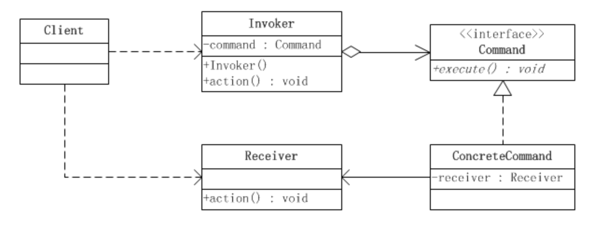

# 命令模式

命令模式属于对象的行为模式。命令模式又称为行动(Action)模式或交易(Transaction)模式。

　　命令模式把一个请求或者操作封装到一个对象中。命令模式允许系统使用不同的请求把客户端参数化，对请求排队或者记录请求日志，可以提供命令的撤销和恢复功能。

命令允许请求的一方和接收请求的一方能够独立演化，从而具有以下的优点：

　　（1）命令模式使新的命令很容易地被加入到系统里。

　　（2）允许接收请求的一方决定是否要处理请求。

　　（3）能较容易地设计一个命令队列。

　　（4）可以容易地实现对请求的撤销和恢复。

　　（5）在需要的情况下，可以较容易地将命令记入日志。

### 命令模式涉及到五个角色，它们分别是：

　　●　　客户端(Client)角色：创建一个具体命令(ConcreteCommand)对象并确定其接收者。

　　●　　命令(Command)角色：声明了一个给所有具体命令类的抽象接口。

　　●　　具体命令(ConcreteCommand)角色：定义一个接收者和行为之间的弱耦合；实现execute()方法，负责调用接收者的相应操作。execute()方法通常叫做执行方法。

　　●　　请求者(Invoker)角色：负责调用命令对象执行请求，相关的方法叫做行动方法。

　　●　　接收者(Receiver)角色：负责具体实施和执行一个请求。任何一个类都可以成为接收者，实施和执行请求的方法叫做行动方法。

## 命令模式的优点

●　　更松散的耦合

　　命令模式使得发起命令的对象——客户端，和具体实现命令的对象——接收者对象完全解耦，也就是说发起命令的对象完全不知道具体实现对象是谁，也不知道如何实现。

　　●　　更动态的控制

　　命令模式把请求封装起来，可以动态地对它进行参数化、队列化和日志化等操作，从而使得系统更灵活。

　　●　　很自然的复合命令

　　命令模式中的命令对象能够很容易地组合成复合命令，也就是宏命令，从而使系统操作更简单，功能更强大。

　　●　　更好的扩展性

　　由于发起命令的对象和具体的实现完全解耦，因此扩展新的命令就很容易，只需要实现新的命令对象，然后在装配的时候，把具体的实现对象设置到命令对象中，然后就可以使用这个命令对象，已有的实现完全不用变化。

注：
1. redis中有redisCommand结构体，和redis交互就是通过一个个命令来进行的；redis中的组合命令可以通过lua脚本来实现，可以实现为一个事务；
