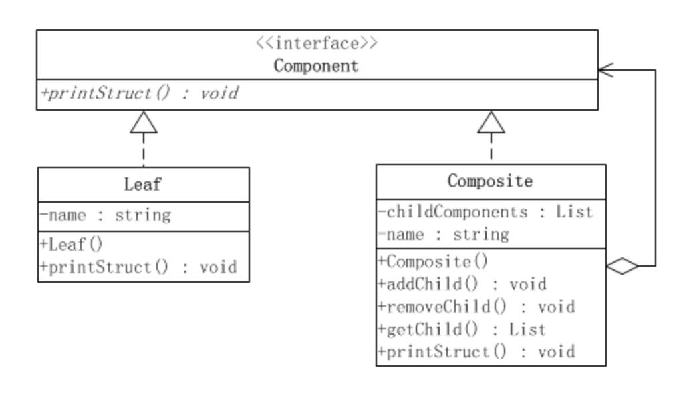

# 组合模式

合成模式属于对象的结构模式，有时又叫做“部分——整体”模式。合成模式将对象组织到树结构中，可以用来描述整体与部分的关系。合成模式可以使客户端将单纯元素与复合元素同等看待。

合成模式把部分和整体的关系用树结构表示出来。合成模式使得客户端把一个个单独的成分对象和由它们复合而成的合成对象同等看待。

**安全式合成模式的结构**

涉及3个构件

1. 抽象构件(Component)角色：这是一个抽象角色，它给参加组合的对象定义出公共的接口及其默认行为，可以用来管理所有的子对象。合成对象通常把它所包含的子对象当做类型为Component的对象。在安全式的合成模式里，构件角色并不定义出管理子对象的方法，这一定义由树枝构件对象给出。

2. 树叶构件(Leaf)角色：树叶对象是没有下级子对象的对象，定义出参加组合的原始对象的行为。

3. 树枝构件(Composite)角色：代表参加组合的有下级子对象的对象

**透明式合成模式**

合成模式而言，在安全性和透明性上，会更看重透明性，毕竟合成模式的目的是：让客户端不再区分操作的是树枝对象还是树叶对象，而是以一个统一的方式来操作。

而且对于安全性的实现，需要区分是树枝对象还是树叶对象。有时候，需要将对象进行类型转换，却发现类型信息丢失了，只好强行转换，这种类型转换必然是不够安全的。

合成模式对于部分还是整体都是同等看待，客户端不需要区分。

注：
1. 在内核中，有线程，进程的概念，在本质上这两种抽象概念是用相同的结构体表示的，唯一的区别就是占有的资源是否是共享的；
