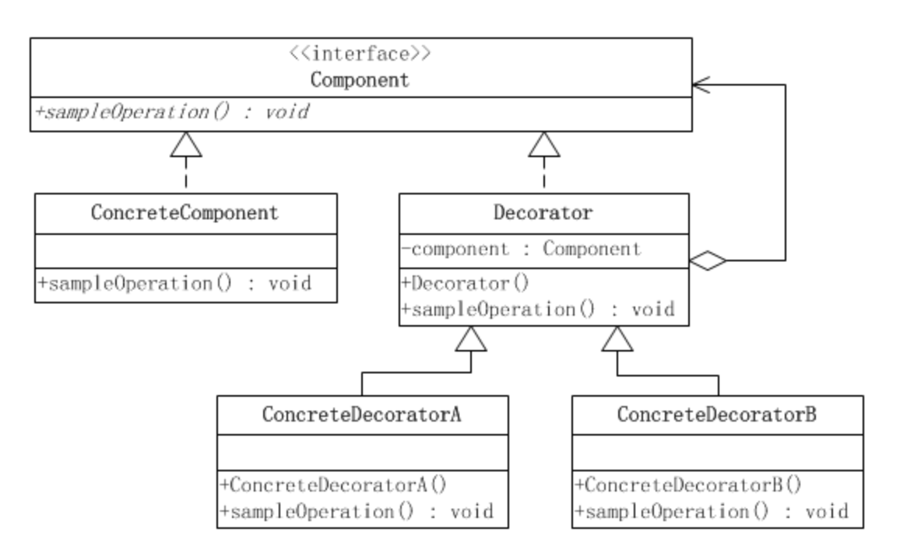

# 装饰器模式

装饰模式又名包装(Wrapper)模式。装饰模式以对客户端透明的方式扩展对象的功能，是继承关系的一个替代方案。

在装饰模式中的角色有：

　　1. 抽象构件(Component)角色：给出一个抽象接口，以规范准备接收附加责任的对象。

　　2. 具体构件(ConcreteComponent)角色：定义一个将要接收附加责任的类。

　　3. 装饰(Decorator)角色：持有一个构件(Component)对象的实例，并定义一个与抽象构件接口一致的接口。

　　4. 具体装饰(ConcreteDecorator)角色：负责给构件对象“贴上”附加的责任。

**装饰模式的优点**

　　（1）装饰模式与继承关系的目的都是要扩展对象的功能，但是装饰模式可以提供比继承更多的灵活性。装饰模式允许系统动态决定“贴上”一个需要的“装饰”，或者除掉一个不需要的“装饰”。继承关系则不同，继承关系是静态的，它在系统运行前就决定了。

　　（2）通过使用不同的具体装饰类以及这些装饰类的排列组合，设计师可以创造出很多不同行为的组合。

**装饰模式的缺点**

　　由于使用装饰模式，可以比使用继承关系需要较少数目的类。使用较少的类，当然使设计比较易于进行。但是，在另一方面，使用装饰模式会产生比使用继承关系更多的对象。更多的对象会使得查错变得困难，特别是这些对象看上去都很相像。

Java I/O库的设计是典型的装饰器模式的应用。

纯粹的装饰模式很难找到。装饰模式的用意是在不改变接口的前提下，增强所考虑的类的性能。在增强性能的时候，往往需要建立新的公开的方法。
