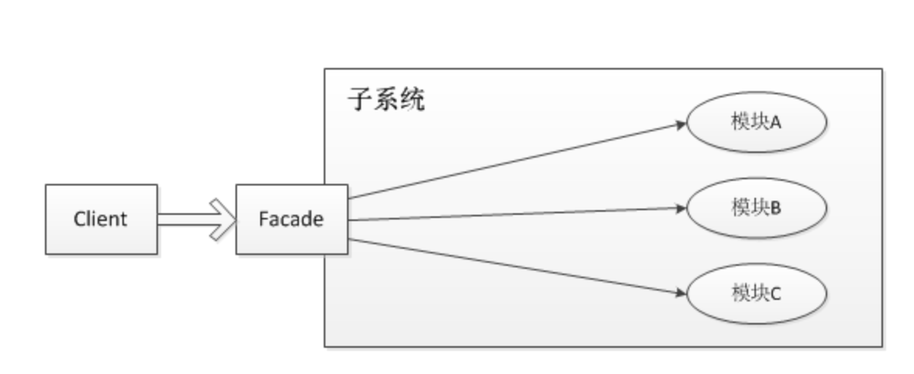

# 门面模式

门面模式是对象的结构模式，外部与一个子系统的通信必须通过一个统一的门面对象进行。门面模式提供一个高层次的接口，使得子系统更易于使用。

隐藏了系统的复杂性，并向客户端提供了一个可以访问系统的接口。这种类型的设计模式属于结构性模式。为子系统中的一组接口提供了一个统一的访问接口，这个接口使得子系统更容易被访问或者使用。

使用场景：
1. 为复杂的模块或子系统提供外界访问的模块
2. 子系统相互独立
3. 层析结构中，可以使用外观模式定义系统的每一层的入口

优点：
1. 松散耦合
2. 简单易用
3. 更好的划分层次访问

注：
1. 门面模式提供了一个统一的访问接口，隐藏了系统的复杂性，对用户非常友好。
2. 如果涉及底层的系统，接口非常多，可以提供一个统一的入口，能够将访问格式统一；
3. 如果对外提供的api太难使用了，通过门面模式重新提供一套简单易用的api吧。

2023-2-23
统一的外观模式，简化使用，像现在有的设计复杂，通过提供高层次的接口简化使用，这也算一种外观模式
