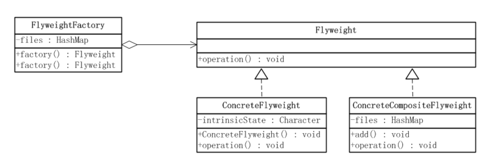

# 享元模式

享元模式以共享的方式高效地支持大量的细粒度对象。

java中String类型的变量是享元模式典型应用。

享元模式采用一个共享来避免大量拥有相同内容对象的开销。这种开销最常见、最直观的就是内存的损耗。享元对象能做到共享的关键是区分内蕴状态(Internal State)和外蕴状态(External State)。

一个内蕴状态是存储在享元对象内部的，并且是不会随环境的改变而有所不同。因此，一个享元可以具有内蕴状态并可以共享。

一个外蕴状态是随环境的改变而改变的、不可以共享的。享元对象的外蕴状态必须由客户端保存，并在享元对象被创建之后，在需要使用的时候再传入到享元对象内部。外蕴状态不可以影响享元对象的内蕴状态，它们是相互独立的。

享元模式可以分成单纯享元模式和复合享元模式两种形式。

**单纯享元模式**

单纯享元模式所涉及到的角色如下：

1. 抽象享元(Flyweight)角色 ：给出一个抽象接口，以规定出所有具体享元角色需要实现的方法。

2. 具体享元(ConcreteFlyweight)角色：实现抽象享元角色所规定出的接口。如果有内蕴状态的话，必须负责为内蕴状态提供存储空间。

3. 享元工厂(FlyweightFactory)角色 ：本角色负责创建和管理享元角色。本角色必须保证享元对象可以被系统适当地共享。当一个客户端对象调用一个享元对象的时候，享元工厂角色会检查系统中是否已经有一个符合要求的享元对象。如果已经有了，享元工厂角色就应当提供这个已有的享元对象；如果系统中没有一个适当的享元对象的话，享元工厂角色就应当创建一个合适的享元对象。

**复合享元模式**

复合享元角色所涉及到的角色如下：

1. 抽象享元(Flyweight)角色 ：给出一个抽象接口，以规定出所有具体享元角色需要实现的方法。

2. 具体享元(ConcreteFlyweight)角色：实现抽象享元角色所规定出的接口。如果有内蕴状态的话，必须负责为内蕴状态提供存储空间。

3. 复合享元(ConcreteCompositeFlyweight)角色 ：复合享元角色所代表的对象是不可以共享的，但是一个复合享元对象可以分解成为多个本身是单纯享元对象的组合。复合享元角色又称作不可共享的享元对象。

4. 享元工厂(FlyweightFactory)角色 ：本角 色负责创建和管理享元角色。本角色必须保证享元对象可以被系统适当地共享。当一个客户端对象调用一个享元对象的时候，享元工厂角色会检查系统中是否已经有 一个符合要求的享元对象。如果已经有了，享元工厂角色就应当提供这个已有的享元对象；如果系统中没有一个适当的享元对象的话，享元工厂角色就应当创建一个 合适的享元对象。

**享元模式的优缺点**
1. 享元模式的优点在于它大幅度地降低内存中对象的数量。但是，它做到这一点所付出的代价也是很高的：

2. 享元模式使得系统更加复杂。为了使对象可以共享，需要将一些状态外部化，这使得程序的逻辑复杂化。

3. 享元模式将享元对象的状态外部化，而读取外部状态使得运行时间稍微变长。

注：
1. redis中使用了很多的共享模式，对于一个对象会有的refCount记录引用的数目；
2. 像Integer部分对象就是共享的，所以执行Integer.parseInt()可能获取的是已经存在的对象；
3. 对于一些大量对象的创建，如果可以使用共享模式，能够极大节省存储空间；
