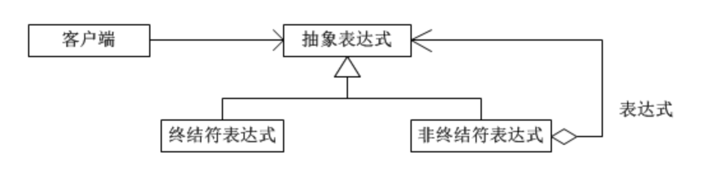
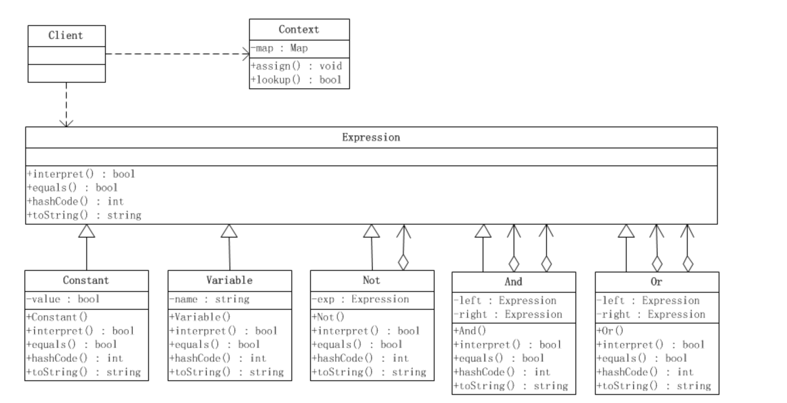

#  解释器模式

解释器模式是类的行为模式。给定一个语言之后，解释器模式可以定义出其文法的一种表示，并同时提供一个解释器。客户端可以使用这个解释器来解释这个语言中的句子。

**模式所涉及的角色如下所示：**

　　（1）抽象表达式(Expression)角色：声明一个所有的具体表达式角色都需要实现的抽象接口。这个接口主要是一个interpret()方法，称做解释操作。

　　（2）终结符表达式(Terminal Expression)角色：实现了抽象表达式角色所要求的接口，主要是一个interpret()方法；文法中的每一个终结符都有一个具体终结表达式与之相对应。比如有一个简单的公式R=R1+R2，在里面R1和R2就是终结符，对应的解析R1和R2的解释器就是终结符表达式。

　　（3）非终结符表达式(Nonterminal Expression)角色：文法中的每一条规则都需要一个具体的非终结符表达式，非终结符表达式一般是文法中的运算符或者其他关键字，比如公式R=R1+R2中，“+"就是非终结符，解析“+”的解释器就是一个非终结符表达式。

　　（4）环境(Context)角色：这个角色的任务一般是用来存放文法中各个终结符所对应的具体值，比如R=R1+R2，我们给R1赋值100，给R2赋值200。这些信息需要存放到环境角色中，很多情况下我们使用Map来充当环境角色就足够了。

