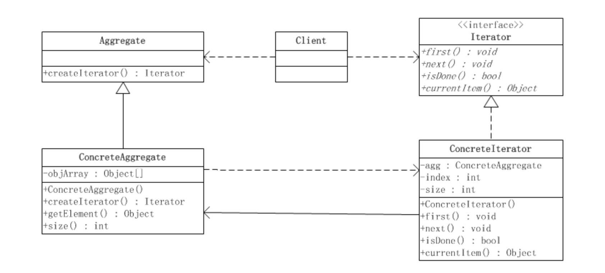

# 迭代器模式

迭代子模式又叫游标(Cursor)模式，是对象的行为模式。迭代子模式可以顺序地访问一个聚集中的元素而不必暴露聚集的内部表象（internal representation）。

多个对象聚在一起形成的总体称之为聚集(Aggregate)，聚集对象是能够包容一组对象的容器对象。聚集依赖于聚集结构的抽象化，具有复杂化和多样性。数组就是最基本的聚集，也是其他的JAVA聚集对象的设计基础。

迭代子模式涉及到以下几个角色：

　　●　　抽象迭代子(Iterator)角色：此抽象角色定义出遍历元素所需的接口。

　　●　　具体迭代子(ConcreteIterator)角色：此角色实现了Iterator接口，并保持迭代过程中的游标位置。

　　●　　聚集(Aggregate)角色：此抽象角色给出创建迭代子(Iterator)对象的接口。

　　●　　具体聚集(ConcreteAggregate)角色：实现了创建迭代子(Iterator)对象的接口，返回一个合适的具体迭代子实例。

　　●　　客户端(Client)角色：持有对聚集及其迭代子对象的引用，调用迭代子对象的迭代接口，也有可能通过迭代子操作聚集元素的增加和删除。

**主动迭代子和被动迭代子**

　　主动迭代子和被动迭代子又称作外部迭代子和内部迭代子。

　　所谓主动（外部）迭代子，指的是由客户端来控制迭代下一个元素的步骤，客户端会明显调用迭代子的next()等迭代方法，在遍历过程中向前进行。

　　所谓被动（内部）迭代子，指的是由迭代子自己来控制迭代下一个元素的步骤。因此，如果想要在迭代的过程中完成工作的话，客户端就需要把操作传递给迭代子，迭代子在迭代的时候会在每个元素上执行这个操作，类似于JAVA的回调机制。

　　总体来说外部迭代器比内部迭代器要灵活一些，因此我们常见的实现多属于主动迭代子。

**静态迭代子和动态迭代子**

　　●　　静态迭代子由聚集对象创建，并持有聚集对象的一份快照(snapshot)，在产生后这个快照的内容就不再变化。客户端可以继续修改原聚集的内容，但是迭代子对象不会反映出聚集的新变化。

　　静态迭代子的好处是它的安全性和简易性，换言之，静态迭代子易于实现，不容易出现错误。但是由于静态迭代子将原聚集复制了一份，因此它的短处是对时间和内存资源的消耗。

　　●　　动态迭代子则与静态迭代子完全相反，在迭代子被产生之后，迭代子保持着对聚集元素的引用，因此，任何对原聚集内容的修改都会在迭代子对象上反映出来。

**优点**

　　（1）迭代子模式简化了聚集的接口。迭代子具备了一个遍历接口，这样聚集的接口就不必具备遍历接口。

　　（2）每一个聚集对象都可以有一个或多个迭代子对象，每一个迭代子的迭代状态可以是彼此独立的。因此，一个聚集对象可以同时有几个迭代在进行之中。

　　（3）由于遍历算法被封装在迭代子角色里面，因此迭代的算法可以独立于聚集角色变化。

注：
1. 迭代模式在集合中很常见的，一般的迭代模式就是简单的顺序遍历，稍微复杂点的可能涉及到并发迭代，只要能够遍历完所有的元素，不关注元素的顺序；
