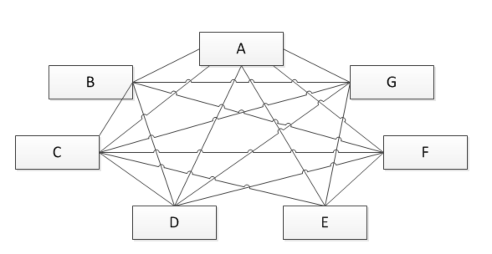
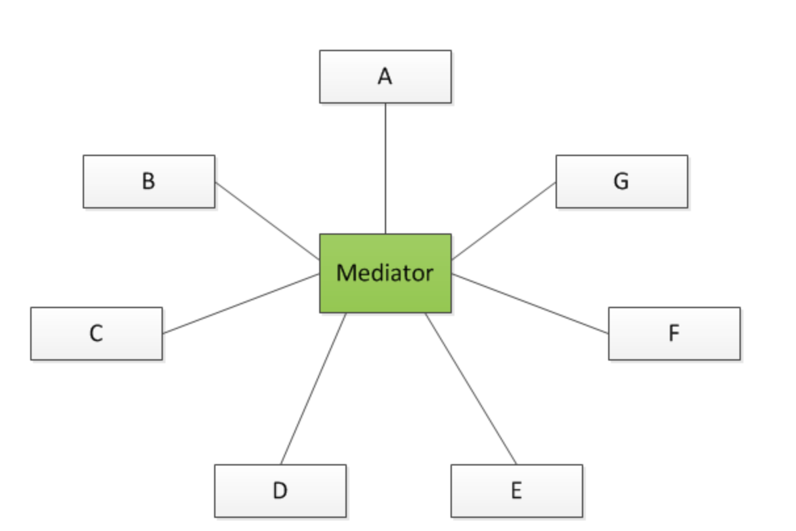

# 调停者模式

调停者模式是对象的行为模式。调停者模式包装了一系列对象相互作用的方式，使得这些对象不必相互明显引用。从而使它们可以较松散地耦合。当这些对象中的某些对象之间的相互作用发生改变时，不会立即影响到其他的一些对象之间的相互作用。从而保证这些相互作用可以彼此独立地变化。

对应关系有多对多变成了一对多。、

**调停前**

**调停后**

**调停者模式包括以下角色：**

1. 抽象调停者(Mediator)角色：定义出同事对象到调停者对象的接口，其中主要方法是一个（或多个）事件方法。

2. 具体调停者(ConcreteMediator)角色：实现了抽象调停者所声明的事件方法。具体调停者知晓所有的具体同事类，并负责具体的协调各同事对象的交互关系。

3. 抽象同事类(Colleague)角色：定义出调停者到同事对象的接口。同事对象只知道调停者而不知道其余的同事对象。

4. 具体同事类(ConcreteColleague)角色：所有的具体同事类均从抽象同事类继承而来。实现自己的业务，在需要与其他同事通信的时候，就与持有的调停者通信，调停者会负责与其他的同事交互。

## 调停者模式的优点
### 松散耦合

　　调停者模式通过把多个同事对象之间的交互封装到调停者对象里面，从而使得同事对象之间松散耦合，基本上可以做到互补依赖。这样一来，同事对象就可以独立地变化和复用，而不再像以前那样“牵一处而动全身”了。

### 集中控制交互

　　多个同事对象的交互，被封装在调停者对象里面集中管理，使得这些交互行为发生变化的时候，只需要修改调停者对象就可以了，当然如果是已经做好的系统，那么就扩展调停者对象，而各个同事类不需要做修改。

### 多对多变成一对多

　　没有使用调停者模式的时候，同事对象之间的关系通常是多对多的，引入调停者对象以后，调停者对象和同事对象的关系通常变成双向的一对多，这会让对象的关系更容易理解和实现。

## 调停者模式的缺点
　　调停者模式的一个潜在缺点是，过度集中化。如果同事对象的交互非常多，而且比较复杂，当这些复杂性全部集中到调停者的时候，会导致调停者对象变得十分复杂，而且难于管理和维护。

注：
1、调停者对象用来维护各个对象的交互关系，关系分散的话，会导致交互不好关系。通过将交互集中管理，会使交互更加清晰，但是调停者对象会比较复杂。
