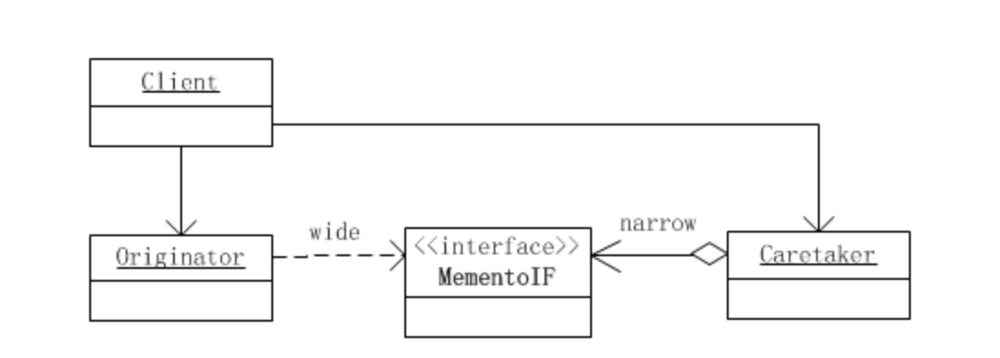

# 备忘录模式

忘录模式又叫做快照模式(Snapshot Pattern)或Token模式，是对象的行为模式。

备忘录对象是一个用来存储另外一个对象内部状态的快照的对象。备忘录模式的用意是在不破坏封装的条件下，将一个对象的状态捕捉(Capture)住，并外部化，存储起来，从而可以在将来合适的时候把这个对象还原到存储起来的状态。备忘录模式常常与命令模式和迭代子模式一同使用。

注：感觉回滚、撤销等操作会用到这个模式。

**备忘录(Memento)角色:**

（1）将发起人（Originator）对象的内部状态存储起来。备忘录可以根据发起人对象的判断来决定存储多少发起人（Originator）对象的内部状态。

（2）备忘录可以保护其内容不被发起人（Originator）对象之外的任何对象所读取。

**备忘录有两个等效的接口：**

(1)窄接口：负责人（Caretaker）对象（和其他除发起人对象之外的任何对象）看到的是备忘录的窄接口(narrow interface)，这个窄接口只允许它把备忘录对象传给其他的对象。

(2)宽接口：与负责人对象看到的窄接口相反的是，发起人对象可以看到一个宽接口(wide interface)，这个宽接口允许它读取所有的数据，以便根据这些数据恢复这个发起人对象的内部状态。

**发起人（Originator）角色:**

(1）创建一个含有当前的内部状态的备忘录对象。

（2）使用备忘录对象存储其内部状态。

**负责人（Caretaker）角色:**

（1）负责保存备忘录对象。

（2）不检查备忘录对象的内容。
