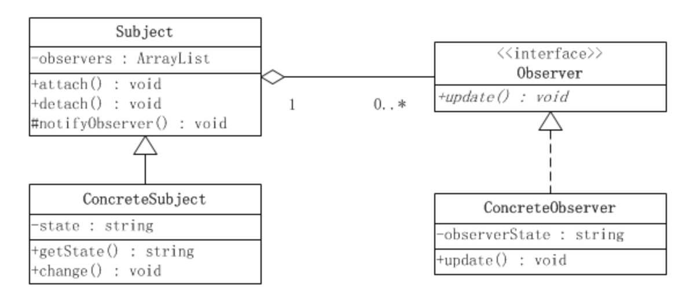

# 观察者模式

观察者模式是对象的行为模式，又叫发布-订阅(Publish/Subscribe)模式、模型-视图(Model/View)模式、源-监听器(Source/Listener)模式或从属者(Dependents)模式。

观察者模式定义了一种一对多的依赖关系，让多个观察者对象同时监听某一个主题对象。这个主题对象在状态上发生变化时，会通知所有观察者对象，使它们能够自动更新自己。

**观察者模式所涉及的角色有：**

1. 抽象主题(Subject)角色：抽象主题角色把所有对观察者对象的引用保存在一个聚集（比如ArrayList对象）里，每个主题都可以有任何数量的观察者。抽象主题提供一个接口，可以增加和删除观察者对象，抽象主题角色又叫做抽象被观察者(Observable)角色。

2. 具体主题(ConcreteSubject)角色：将有关状态存入具体观察者对象；在具体主题的内部状态改变时，给所有登记过的观察者发出通知。具体主题角色又叫做具体被观察者(Concrete Observable)角色。

3. 抽象观察者(Observer)角色：为所有的具体观察者定义一个接口，在得到主题的通知时更新自己，这个接口叫做更新接口。

4. 具体观察者(ConcreteObserver)角色：存储与主题的状态自恰的状态。具体观察者角色实现抽象观察者角色所要求的更新接口，以便使本身的状态与主题的状态 像协调。如果需要，具体观察者角色可以保持一个指向具体主题对象的引用。

两种模式:推和拉模型。

java提供了对观察者模式支持的接口。

在JAVA语言的java.util库里面，提供了一个Observable类以及一个Observer接口，构成JAVA语言对观察者模式的支持。

注：
1. 观察者模式耦合性还是挺强的，除非像MQ那种发布订阅模式，有一个中间层对象Broker来参与，这样发布者和观察者就进行了解耦。
不管是发布者还是观察者变化，都是独立的；
