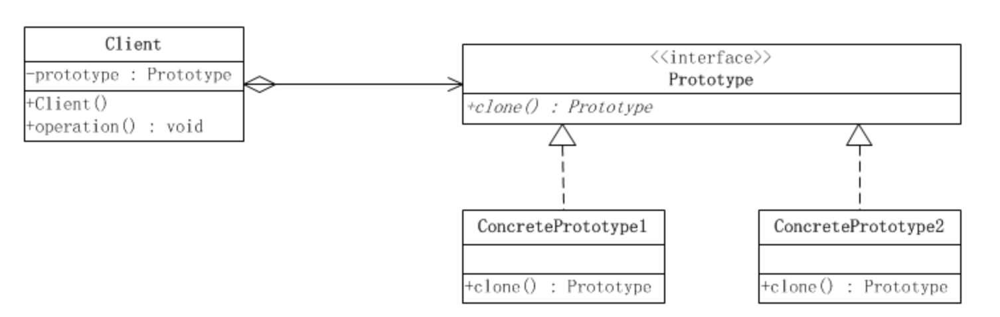

# 原型模式

原型模式属于对象的创建模式。通过给出一个原型对象来指明所有创建的对象的类型，然后用复制这个原型对象的办法创建出更多同类型的对象。这就是原型模式的用意。

这种形式涉及到三个角色：

1. 客户(Client)角色：客户类提出创建对象的请求。

2. 抽象原型(Prototype)角色：这是一个抽象角色，通常由一个Java接口或Java抽象类实现。此角色给出所有的具体原型类所需的接口。

3. 具体原型（Concrete Prototype）角色：被复制的对象。此角色需要实现抽象的原型角色所要求的接口。

**原型模式的优点**  
　　原型模式允许在运行时动态改变具体的实现类型。原型模式可以在运行期间，由客户来注册符合原型接口的实现类型，也可以动态地改变具体的实现类型，看起来接口没有任何变化，但其实运行的已经是另外一个类实例了。因为克隆一个原型就类似于实例化一个类。

**原型模式的缺点**  
　　原型模式最主要的缺点是每一个类都必须配备一个克隆方法。配备克隆方法需要对类的功能进行通盘考虑，这对于全新的类来说不是很难，而对于已经有的类不一定很容易，特别是当一个类引用不支持序列化的间接对象，或者引用含有循环结构的时候。

原型模式即在当前类的基础上创建出一个新的类，说到底就是怎么克隆出一个对象，可以通过浅拷贝和深拷贝方式。
