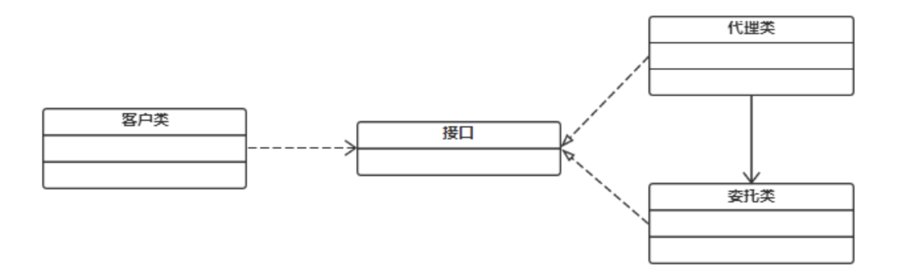

# 代理模式

代理模式的定义：代理模式给某一个对象提供一个代理对象，并由代理对象控制对原对象的引用。通俗的来讲代理模式就是我们生活中常见的中介。

为了什么需要代理？  
**中介隔离作用**：在某些情况下，一个客户类不想或者不能直接引用一个委托对象，而代理类对象可以在客户类和委托对象之间起到中介的作用，其特征是代理类和委托类实现相同的接口。  
**开闭原则，增加功能**：代理类除了是客户类和委托类的中介之外，我们还可以通过给代理类增加额外的功能来扩展委托类的功能，这样做我们只需要修改代理类而不需要再修改委托类，符合代码设计的开闭原则。代理类主要负责为委托类预处理消息、过滤消息、把消息转发给委托类，以及事后对返回结果的处理等。代理类本身并不真正实现服务，而是同过调用委托类的相关方法，来提供特定的服务。真正的业务功能还是由委托类来实现，但是可以在业务功能执行的前后加入一些公共的服务。例如我们想给项目加入缓存、日志这些功能，我们就可以使用代理类来完成，而没必要打开已经封装好的委托类。

在java中有静态代理，静态代理需要针对每一个具体类实现一个代理类，不太合理。如果代理类格式比较相似，可以提供使用动态代理。java中常见的动态代理包括：JDK动态代理和cglib动态代理。

适用性：
1. 远程代理：为一个对象在不同的地址空间提供局部代表。
2. 虚代理：根据需要创建开销很大的对象。
3. 保护代理：控制对原始对象的访问。
4. 智能指引：取代了简单的指针，它在访问对象时执行了一些附加操作。
