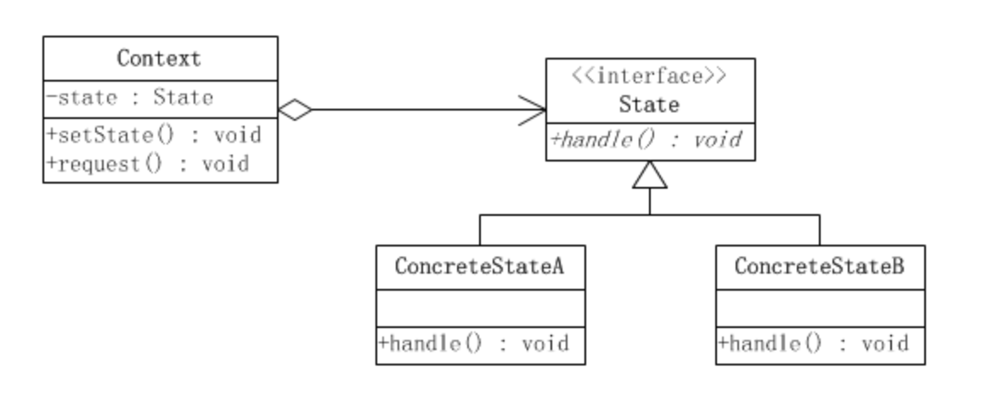

# 状态模式

状态模式，又称状态对象模式（Pattern of Objects for States），状态模式是对象的行为模式。

状态模式允许一个对象在其内部状态改变的时候改变其行为。这个对象看上去就像是改变了它的类一样。

状态模式所涉及到的角色有：

1. 环境(Context)角色，也成上下文：定义客户端所感兴趣的接口，并且保留一个具体状态类的实例。这个具体状态类的实例给出此环境对象的现有状态。

2. 抽象状态(State)角色：定义一个接口，用以封装环境（Context）对象的一个特定的状态所对应的行为。

3. 具体状态(ConcreteState)角色：每一个具体状态类都实现了环境（Context）的一个状态所对应的行为。

所谓状态模式，即状态是和行为挂钩的，当满足不同的条件时，会处于不同的状态，从而进入不同的行为。比如常用的限流、防刷等操作。

状态模式，行为具有平行性；而策略模式，行为具有替换性。

注：
策略模式，不同的实现最终完成的还是相同的事情；
而状态模式，不同的实现是和不同的状态挂钩的；
