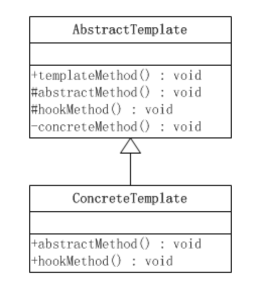

# 模板方法模式

模板方法模式是类的行为模式。准备一个抽象类，将部分逻辑以具体方法以及具体构造函数的形式实现，然后声明一些抽象方法来迫使子类实现剩余的逻辑。不同的子类可以以不同的方式实现这些抽象方法，从而对剩余的逻辑有不同的实现。这就是模板方法模式的用意。（顶层方法由多个子方法组合而成，子方法包括抽象方法、具体实现方法、钩子方法）

涉及到轮廓的概念。

**抽象模板(Abstract Template)角色有如下责任：**

1. 定义了一个或多个抽象操作，以便让子类实现。这些抽象操作叫做基本操作，它们是一个顶级逻辑的组成步骤。

2. 定义并实现了一个模板方法。这个模板方法一般是一个具体方法，它给出了一个顶级逻辑的骨架，而逻辑的组成步骤在相应的抽象操作中，推迟到子类实现。顶级逻辑也有可能调用一些具体方法。

**具体模板(Concrete Template)角色又如下责任：**

1. 实现父类所定义的一个或多个抽象方法，它们是一个顶级逻辑的组成步骤。

2. 每一个抽象模板角色都可以有任意多个具体模板角色与之对应，而每一个具体模板角色都可以给出这些抽象方法（也就是顶级逻辑的组成步骤）的不同实现，从而使得顶级逻辑的实现各不相同。

**基本方法**

　基本方法又可以分为三种：抽象方法(Abstract Method)、具体方法(Concrete Method)和钩子方法(Hook Method)。

1. 抽象方法：一个抽象方法由抽象类声明，由具体子类实现。在Java语言里抽象方法以abstract关键字标示。

2. 具体方法：一个具体方法由抽象类声明并实现，而子类并不实现或置换。

3. 钩子方法：一个钩子方法由抽象类声明并实现，而子类会加以扩展。通常抽象类给出的实现是一个空实现，作为方法的默认实现。

向外暴露的方法只是顶层方法，基本方法通过private、protected来控制访问域。

HttpServlet是模板方法的典型应用。
