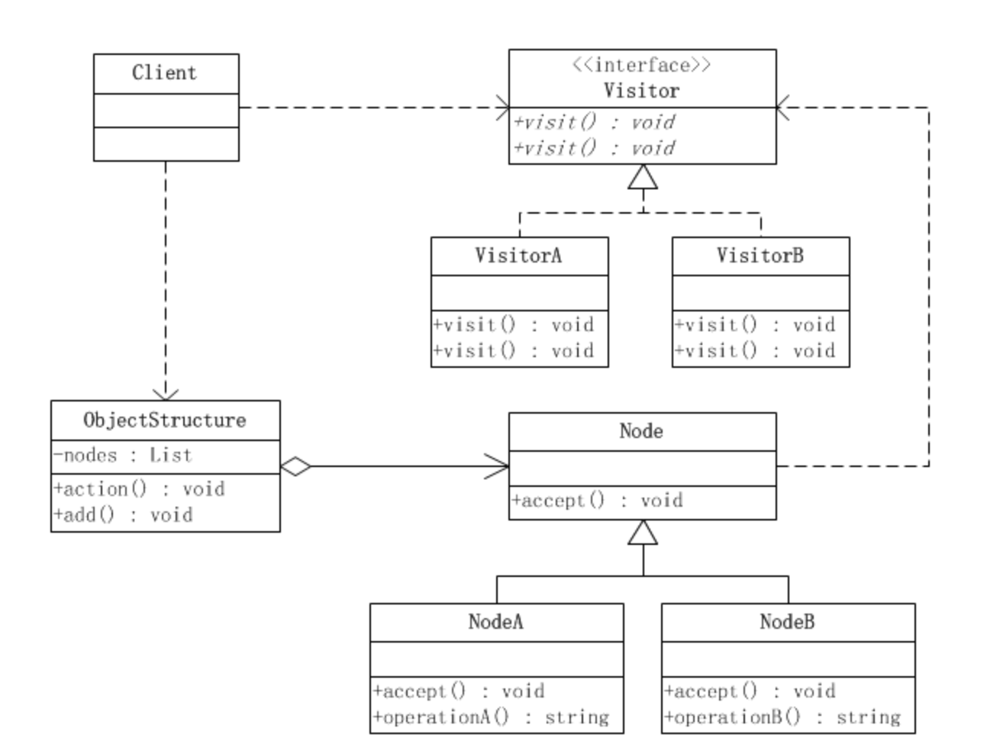

# 访问者模式

访问者模式是对象的行为模式。访问者模式的目的是封装一些施加于某种**数据结构元素**之上的操作。一旦这些操作需要修改的话，接受这个操作的数据结构则可以保持不变。

根据对象的类型而对方法进行的选择，就是分派(Dispatch)，分派(Dispatch)又分为两种，即静态分派和动态分派。

　　静态分派(Static Dispatch)发生在编译时期，分派根据静态类型信息发生。静态分派对于我们来说并不陌生，方法重载就是静态分派。

　　动态分派(Dynamic Dispatch)发生在运行时期，动态分派动态地置换掉某个方法。

java中重载就是典型的静态分派，编译时确定；重写就是动态分派的应用，运行时确定。

*java是静态的多分派语言，又是动态的但分派语言；通过使用设计模式，可以在行为上体现动态的多分派。*

访问者模式涉及到的角色如下：

1. 抽象访问者(Visitor)角色：声明了一个或者多个方法操作，形成所有的具体访问者角色必须实现的接口。

2. 具体访问者(ConcreteVisitor)角色：实现抽象访问者所声明的接口，也就是抽象访问者所声明的各个访问操作。

3. 抽象节点(Node)角色：声明一个接受操作，接受一个访问者对象作为一个参数。

4. 具体节点(ConcreteNode)角色：实现了抽象节点所规定的接受操作。

5. 结构对象(ObjectStructure)角色：有如下的责任，可以遍历结构中的所有元素；如果需要，提供一个高层次的接口让访问者对象可以访问每一个元素；如果需要，可以设计成一个复合对象或者一个聚集，如List或Set。

## 访问者模式的优点
　　●　　好的扩展性

　　能够在不修改对象结构中的元素的情况下，为对象结构中的元素添加新的功能。

　　●　　好的复用性

　　可以通过访问者来定义整个对象结构通用的功能，从而提高复用程度。

　　●　　分离无关行为

　　可以通过访问者来分离无关的行为，把相关的行为封装在一起，构成一个访问者，这样每一个访问者的功能都比较单一。

## 访问者模式的缺点
　　●　　对象结构变化很困难

　　不适用于对象结构中的类经常变化的情况，因为对象结构发生了改变，访问者的接口和访问者的实现都要发生相应的改变，代价太高。

　　●　　破坏封装

　　访问者模式通常需要对象结构开放内部数据给访问者和ObjectStructrue，这破坏了对象的封装性。
