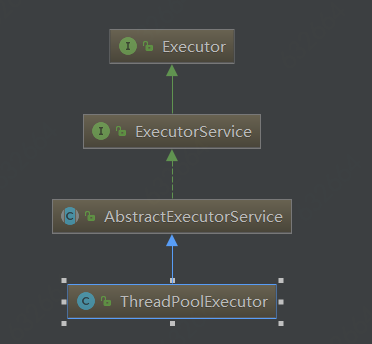

# ThreadPoolExecutor线程池实现原理

> 线程池在工作中用到很多，也清楚其中的一些参数的配置，但是呢，总是对怎么标识空闲线程、活动线程不太清楚。空闲线程具体是怎么回收的？我之前一直在想一个线程的run方法执行完之后这个线程不就会被销毁了吗？怎么实现重复利用的呢？带着这些疑问，看了看底层的源码。

**先来看看ThreadPollExecutor的继承结构**


Executor接口中就一个execute方法，入参是Runnable；ExecutorService这个接口中又扩充了一些方法，主要是用来管理termination和提供一些能够返回Future的方法，用来跟踪异步任务的执行过程；AbstractExecutorService这个抽象类提供了ExecutorService这个接口很多方法的默认实现。

## ThreadPoolExecutor核心的成员变量
- **private final BlockingQueue<Runnable> workQueue**
workQueue是一个阻塞队列，当任务到来时，且当前创建的线程个数超过了核心线程的数据，则新到来的任务就放到这个队列中。

- **private final HashSet<Worker> workers = new HashSet<Worker>();**
这个Set集合很核心，每一个Worker都会与一个线程进行关联的，你可以认为创建的线程都放到这个集合中，不管是活动的线程还是空闲的线程。

- **private volatile ThreadFactory threadFactory;**
见名知义，需要需要额外创建线程，就是调用这个线程工厂类来进行创建的，主要调用内部的newThread方法。

- **private volatile RejectedExecutionHandler handler;**
这个就是拒绝执行处理器，当线程池饱和无法处理新来的任务时，或者线程池被关闭时，当新的任务到来时，就会调用这个接口的rejectedExecution这个方法。目前提供了这个接口的几个默认实现：DiscardPolicy（任务来时，直接进行丢弃，所以基本无啥感知）、DiscardOldestPolicy（会把等待时间最老的请求丢弃，重新调用线程池的execute方法）、AbortPolicy（会抛出异常，即会把异常抛给主线程，如果是可以忽略的请求，最好不要用此策略，如果想消费MQ之类的消息的话，需要用这个策略，免得没有消费的MQ无法重新消费）、CallerRunsPolicy（先判断当前线程是否被关闭了，没有的话，直接在调用者线程执行此任务，所以如果任务执行的比较慢的话，可是会阻塞当前的主线程的）

- **private volatile long keepAliveTime;**
空闲线程等到获取任务的最大空闲时间，后面会说明什么情况下当获取任务超时后会进行线程的回收，什么情况会一直等待直到获取一个新的任务

- **private volatile boolean allowCoreThreadTimeOut;**
我相信很多人没有用过这个参数，这个参数表明如果核心线程等待任务超时了是否回收，正常情况下我们都是回收大于核心线程数的空闲线程

- **private volatile int corePoolSize**
核心线程数的数目，如果任务来了，但当前线程数还小于核心线程数，则会继续创建线程来处理任务，而不是把任务放到队列中。

- **private volatile int maximumPoolSize**
最大的线程数目，相当于workers这个set集合中元素的最大数目。

- **核心类Worker**
这个类就会与一个线程进行关联，其继承于AbstractQueuedSynchronizer这个类，并实现了Runnable接口。所以会用到AQS提供的锁的机制。Worker中的三个成员变量分别为：thread（与当前worker关联的线程）、firstTask（线程执行的第一个任务，可以为null）、completedTasks（当前线程已经完成的任务，主要是统计数据的）

上面就是ThreadPoolExecutor这个类中的核心成员变量，下面从方法级别看看具体的执行过程。

### 核心方法

#### execute(Runnable)
这个方法是最核心的，想submit方法内部的主要逻辑也是调用execute这个方法，看看内部代码
```java
public void execute(Runnable command) {
        if (command == null)
            throw new NullPointerException();
        /*
         * Proceed in 3 steps:
         *
         * 1. If fewer than corePoolSize threads are running, try to
         * start a new thread with the given command as its first
         * task.  The call to addWorker atomically checks runState and
         * workerCount, and so prevents false alarms that would add
         * threads when it shouldn't, by returning false.
         *
         * 2. If a task can be successfully queued, then we still need
         * to double-check whether we should have added a thread
         * (because existing ones died since last checking) or that
         * the pool shut down since entry into this method. So we
         * recheck state and if necessary roll back the enqueuing if
         * stopped, or start a new thread if there are none.
         *
         * 3. If we cannot queue task, then we try to add a new
         * thread.  If it fails, we know we are shut down or saturated
         * and so reject the task.
         */
        int c = ctl.get();
        // 当前线程总数如果小于核心线程数，会创建一个新的线程执行当前任务
        if (workerCountOf(c) < corePoolSize) {
          // addWorker这个方法就会导致一个新的线程创建
            if (addWorker(command, true))
                return;
            c = ctl.get();
        }
        // 如果当前线程池还处于运行状态，往队列中加入当前任务
        if (isRunning(c) && workQueue.offer(command)) {
            int recheck = ctl.get();
            // 加完任务后再次校验当前线程池是否还是处于运行状态，如果停止的话，尝试将任务从任务池中移除，移除成功的话就拒绝当前任务的执行
            if (! isRunning(recheck) && remove(command))
                reject(command);
            // 应该是当前线程因为什么原因都死亡了，比如超时了呀，所有创建一个新的线程来执行队列中的任务    
            else if (workerCountOf(recheck) == 0)
                addWorker(null, false);
        }
        // 如果任务入列失败，可能是队列中满了，尝试创建一个非核心的线程，如果maxminuxPoolSize大于corePoolSize，就是能够进行创建的
        else if (!addWorker(command, false))
            reject(command);
    }
```

不管是基于源文档的说明还是我的中文标注，大家应该明白execute执行的具体过程了，下面看看addWorker这个方法的源码。
```java
private boolean addWorker(Runnable firstTask, boolean core) {
        retry:
        for (;;) {
            int c = ctl.get();
            int rs = runStateOf(c);

            // Check if queue empty only if necessary.
            // 主要是判断线程池的状态，满足这个条件的话就没必要创建新的线程了
            if (rs >= SHUTDOWN &&
                ! (rs == SHUTDOWN &&
                   firstTask == null &&
                   ! workQueue.isEmpty()))
                return false;

            for (;;) {
                int wc = workerCountOf(c);
                // 如果创建的线程数超过了容量或者如果是核心线程且超过了核心线程的数据或者不是核心线程且超过了最大线程数，这样就没必须创建新的线程了
                if (wc >= CAPACITY ||
                    wc >= (core ? corePoolSize : maximumPoolSize))
                    return false;
                if (compareAndIncrementWorkerCount(c))
                    break retry;
                c = ctl.get();  // Re-read ctl
                if (runStateOf(c) != rs)
                    continue retry;
                // else CAS failed due to workerCount change; retry inner loop
            }
        }

        boolean workerStarted = false;
        boolean workerAdded = false;
        Worker w = null;
        try {
            w = new Worker(firstTask);
            final Thread t = w.thread;
            if (t != null) {
                final ReentrantLock mainLock = this.mainLock;
                // 看看这里的加锁，当向workers的set集合中加入新的worker时，是需要保证同步的
                mainLock.lock();
                try {
                    // Recheck while holding lock.
                    // Back out on ThreadFactory failure or if
                    // shut down before lock acquired.
                    int rs = runStateOf(ctl.get());

                    if (rs < SHUTDOWN ||
                        (rs == SHUTDOWN && firstTask == null)) {
                        if (t.isAlive()) // precheck that t is startable
                            throw new IllegalThreadStateException();
                        workers.add(w);
                        int s = workers.size();
                        if (s > largestPoolSize)
                            largestPoolSize = s;
                        workerAdded = true;
                    }
                } finally {
                    mainLock.unlock();
                }
                if (workerAdded) {
                    // 如果加入worker成功，启动当前新创建的线程
                    t.start();
                    workerStarted = true;
                }
            }
        } finally {
            if (! workerStarted)
                addWorkerFailed(w);
        }
        return workerStarted;
    }
```

```java
Worker(Runnable firstTask) {
            setState(-1); // inhibit interrupts until runWorker
            this.firstTask = firstTask;
            // 看看这里，当创建新的线程池时，会将Worker的这个实例做一个Task传给新创建的线程，所以线程启动后会调用Worker的run方法，下面看看怎么执行的。
            this.thread = getThreadFactory().newThread(this);
        }
```

```java
/** Delegates main run loop to outer runWorker  */
public void run() {
  runWorker(this);
}

// 大家好好看看这个方法，这个方法才是真正执行我们任务的地方，要么任务来了直接创建一个新的线程来执行，要么从任务队列中取任务进行执行。
final void runWorker(Worker w) {
    Thread wt = Thread.currentThread();
    Runnable task = w.firstTask;
    w.firstTask = null;
    w.unlock(); // allow interrupts
    boolean completedAbruptly = true;
    try {
        // 如果与当前Worker关联的firstTask不为null，则首先执行这个任务，否则的话调用getTask这个方法从阻塞队列中尝试获取一个任务（getTask下面讲一下，看看里面如何做的）
        while (task != null || (task = getTask()) != null) {
           // 将当前的workder进行加锁操作，其实这一步稍微有点糊涂的，调用w.lock的地方不会只可能在一个线程中吗？这个加锁有啥用呢？有一点有意思的是如果Worker是处于lock状态，则表明与其关联的线程是活动线程，否则的话就是空闲线程，希望大家能够看到这句话。
            w.lock();
            // If pool is stopping, ensure thread is interrupted;
            // if not, ensure thread is not interrupted.  This
            // requires a recheck in second case to deal with
            // shutdownNow race while clearing interrupt
            if ((runStateAtLeast(ctl.get(), STOP) ||
                 (Thread.interrupted() &&
                  runStateAtLeast(ctl.get(), STOP))) &&
                !wt.isInterrupted())
                wt.interrupt();
            try {
                beforeExecute(wt, task);
                Throwable thrown = null;
                try {
                    // 这里就是实际我们写的任务，通常都是我们实现Runnable接口，来定义任务
                    task.run();
                } catch (RuntimeException x) {
                    thrown = x; throw x;
                } catch (Error x) {
                    thrown = x; throw x;
                } catch (Throwable x) {
                    thrown = x; throw new Error(x);
                } finally {
                    afterExecute(task, thrown);
                }
            } finally {
                task = null;
                w.completedTasks++;
                w.unlock();
            }
        }
        completedAbruptly = false;
    } finally {
        processWorkerExit(w, completedAbruptly);
    }
}
```

```java
private Runnable getTask() {
        boolean timedOut = false; // Did the last poll() time out?

        for (;;) {
            int c = ctl.get();
            int rs = runStateOf(c);

            // Check if queue empty only if necessary.
            if (rs >= SHUTDOWN && (rs >= STOP || workQueue.isEmpty())) {
                decrementWorkerCount();
                return null;
            }

            int wc = workerCountOf(c);

            // Are workers subject to culling?
            // 如果允许空闲线程超时，或者当前线程数大于核心线程数，如果获取任务超时了，会回收当前的线程
            boolean timed = allowCoreThreadTimeOut || wc > corePoolSize;
            // 如果最后返回的是null，会导致外部的runWorker方法执行processWorkerExit这个方法的，这个方法会直接将当前Worker移除set集合的，相当于销毁与之关联的线程。
            if ((wc > maximumPoolSize || (timed && timedOut))
                && (wc > 1 || workQueue.isEmpty())) {
                if (compareAndDecrementWorkerCount(c))
                    return null;
                continue;
            }

            try {
                // timed等于true的话，相当于如果获取任务超时了，就可以将当前线程回收了，在执行poll或者take时当先线程都会进入等待状态，此时会让出CPU资源的
                Runnable r = timed ?
                    workQueue.poll(keepAliveTime, TimeUnit.NANOSECONDS) :
                    workQueue.take();
                if (r != null)
                    return r;
                timedOut = true;
            } catch (InterruptedException retry) {
                timedOut = false;
            }
        }
    }
```

上面就是ThreadPoolExecutor中的一些核心方法，当然了还有很多其他方法，但是如果能够将上面的方法理解清楚，很多的其他方法自然也理解了，如果看上面的介绍还是有些懵懂，大家最好翻翻源码。

### 总结
1、怎么区分活动线程和空闲线程？
我们知道线程会和一个Worker实例进行关联的，而在执行一个任务时，会首先调用Worker的lock方法进行加锁操作，所以Worker被加锁的都是活动线程，而没有被加锁的线程都是空闲线程，看看下面的几行代码就非常清楚了。
```java
public int getActiveCount() {
        final ReentrantLock mainLock = this.mainLock;
        mainLock.lock();
        try {
            int n = 0;
            for (Worker w : workers)
                // 如果worker被锁住，则表示活动线程
                if (w.isLocked())
                    ++n;
            return n;
        } finally {
            mainLock.unlock();
        }
    }
```

2、调用什么方法会导致线程处于空闲状态？
线程嘛，肯定需要取执行任务的，如果没有任务可执行了，那么线程自然处于空闲状态了，主要的代码是调用getTask方法中的几句。
```java
Runnable r = timed ?
                    workQueue.poll(keepAliveTime, TimeUnit.NANOSECONDS) :
                    workQueue.take();
```
workQueue是一个阻塞队列，当在线程中调用poll方法时会进行Timed_Wait状态，而调用take会导致线程进入Wait状态，这两种状态都会导致当前线程让出CPU资源，需要队列非空时，或者超时时重新换新当前线程。

上面是我第一次详细看了看源码学到的一些东西，如果那里有不对的地方，欢迎指正，需要和大家功能进步。
