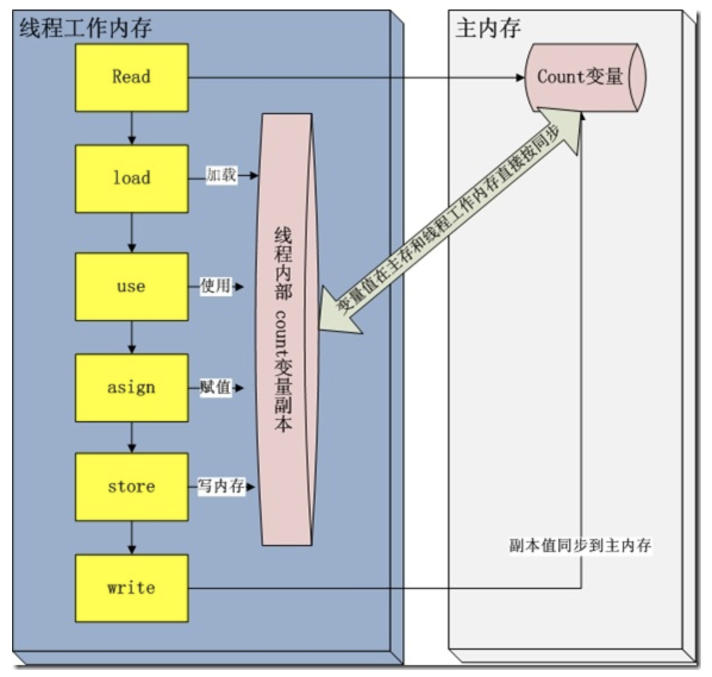

## java并发内存模型以及内存操作规则

java内存模型中规定了所有变量都存贮到主内存（如虚拟机物理内存中的一部分）中。每一个线程都有一个自己的工作内存(如cpu中的高速缓存)。线程中的工作内存保存了该线程使用到的变量的主内存的副本拷贝。线程对变量的所有操作（读取、赋值等）必须在该线程的工作内存中进行。不同线程之间无法直接访问对方工作内存中变量。线程间变量的值传递均需要通过主内存来完成。

关于主内存与工作内存之间的交互协议，即一个变量如何从主内存拷贝到工作内存。如何从工作内存同步到主内存中的实现细节。java内存模型定义了8种操作来完成。这8种操作每一种都是原子操作。8种操作如下：

lock(锁定)：作用于主内存，它把一个变量标记为一条线程独占状态；
read(读取)：作用于主内存，它把变量值从主内存传送到线程的工作内存中，以便随后的load动作使用；
load(载入)：作用于工作内存，它把read操作的值放入工作内存中的变量副本中；
use(使用)：作用于工作内存，它把工作内存中的值传递给执行引擎，每当虚拟机遇到一个需要使用这个变量的指令时候，将会执行这个动作；
assign(赋值)：作用于工作内存，它把从执行引擎获取的值赋值给工作内存中的变量，每当虚拟机遇到一个给变量赋值的指令时候，执行该操作；
store(存储)：作用于工作内存，它把工作内存中的一个变量传送给主内存中，以备随后的write操作使用；
write(写入)：作用于主内存，它把store传送值放到主内存中的变量中。

unlock(解锁)：作用于主内存，它将一个处于锁定状态的变量释放出来，释放后的变量才能够被其他线程锁定；
Java内存模型还规定了执行上述8种基本操作时必须满足如下规则:

1、不允许read和load、store和write操作之一单独出现（即不允许一个变量从主存读取了但是工作内存不接受，或者从工作内存发起会写了但是主存不接受的情况），以上两个操作必须按顺序执行，但没有保证必须连续执行，也就是说，read与load之间、store与write之间是可插入其他指令的。
2、不允许一个线程丢弃它的最近的assign操作，即变量在工作内存中改变了之后必须把该变化同步回主内存。
3、不允许一个线程无原因地（没有发生过任何assign操作）把数据从线程的工作内存同步回主内存中。
4、一个新的变量只能从主内存中“诞生”，不允许在工作内存中直接使用一个未被初始化（load或assign）的变量，换句话说就是对一个变量实施use和store操作之前，必须先执行过了assign和load操作。
5、一个变量在同一个时刻只允许一条线程对其执行lock操作，但lock操作可以被同一个条线程重复执行多次，多次执行lock后，只有执行相同次数的unlock操作，变量才会被解锁。
6、如果对一个变量执行lock操作，将会清空工作内存中此变量的值，在执行引擎使用这个变量前，需要重新执行load或assign操作初始化变量的值。
7、如果一个变量实现没有被lock操作锁定，则不允许对它执行unlock操作，也不允许去unlock一个被其他线程锁定的变量。
8、对一个变量执行unlock操作之前，必须先把此变量同步回主内存（执行store和write操作）。
