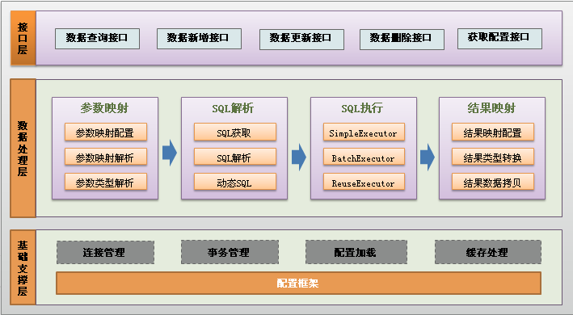

1. 架构图

2. 核心的类
- SqlSession
mybatis的主接口，可以用于执行命令、获取mapper、管理事务

- SqlSessionTemplate
实现mybatis和spring绑定的一个类。是线程安全的，进行构造时，只需要传递一个SqlSessionFactory即可。

- DefaultSqlSession
这个是SqlSession的主要实现，需要的主要参数一个是Configuration、Excutor、autoCommit

- MappedStatement
是Mapper文件中配置的一条记录

- BoundSql
表示一条具体的sql

- Excutor
这个接口就非常重要的，具体的执行都会

- TypeHandler
这个类很重要，可以进行重写，它的子类实现了sql数据类型和java数据类型的转换；
