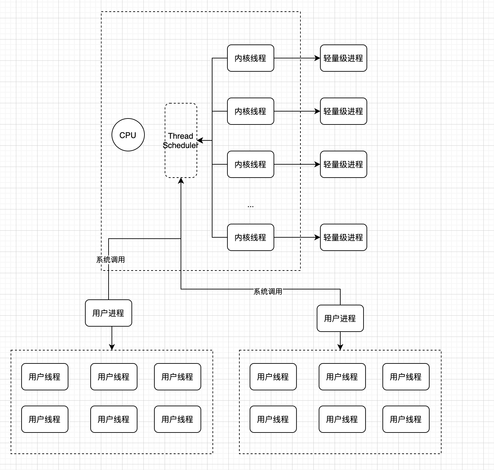
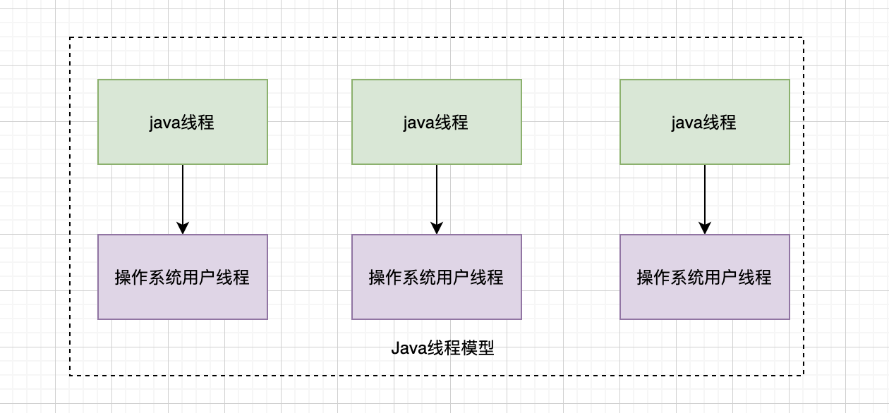
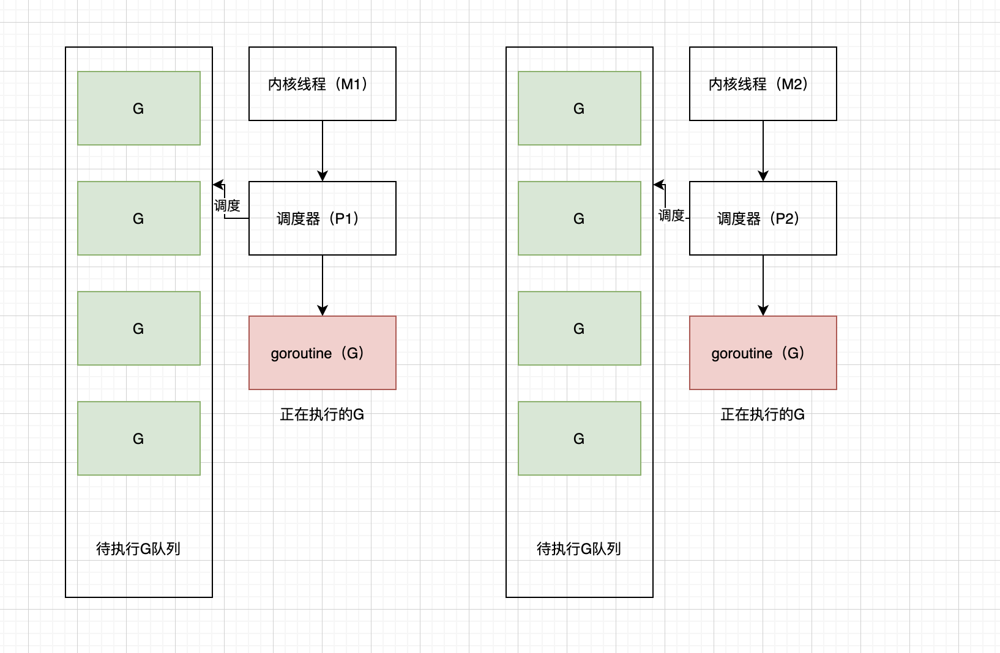
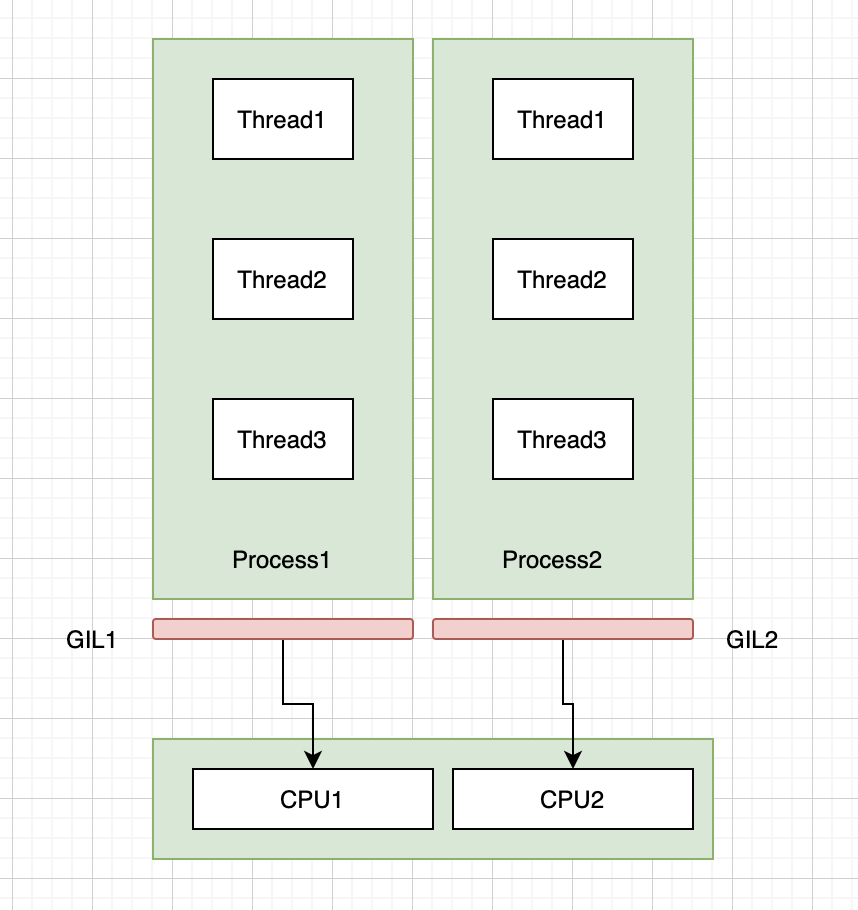

# 常用语言的线程模型

## 背景知识

1. 软件是如何驱动硬件的？  
硬件是需要相关的驱动程序才能执行，而驱动程序是安装在操作系统内核中。如果写了一个程序A，A程序想操作硬件工作，首先需要进行系统调用，由内核去找对应的驱动程序驱使硬件工作。而驱动程序怎么让硬件工作的呢？驱动程序作为硬件和操作系统之间的媒介，可以把操作系统中相关的指令翻译成硬件能够识别的电信号，同时，驱动程序也可以将硬件的电信号转为操作系统能够识别的指令。

2. 进程、轻量级进程、线程关系  
一个进程由于所运行的空间不同，被分为内核线程和用户进程，之所有称之为内核线程，是因为其不拥有虚拟地址空间。如果创建一个新的用户进程，会分配一个新的虚拟地址空间，不同用户进程之间资源是隔离的。由于创建一个新的进程需要消耗很多的资源，并且在进程之间切换的代价也很昂贵，因此引入了轻量级进程。轻量级进行本质上也是对内核线程的高层抽象，虽然不同的轻量级进程之间可以共享某些资源，但由于轻量级进程本质上还是内核线程，如果进行轻量级线程之间的切换，需要进行系统调用，代价也是比较昂贵的。内核本质上只能感知到进程的存在，像不同语言的多线程技术，是在用户进程的基础上创建的线程库，线程本身不参与处理器竞争，而是由其所属的用户进程参与处理器的竞争。

3. 如何理解用户态和内核态  
首先我们需要理解到计算机资源是有限的，不管是CPU资源、内存资源、IO资源、网络资源，为了保证这些资源的合理利用，需要有一个管控机制，而这个管控机制都是交于操作系统来处理的。用户态和内核态是操作系统的一种逻辑划分，本质上是进行权限控制，处于用户态的进程可以直接使用分配给其的内存空间，但如果想使用CPU等稀缺资源，处于用户态的进程就没有这个权限了，必须通过系统调用，让当前进程进入内核态，这样可以有更大的权限去申请CPU资源、内存资源、IO资源等；   

## 操作系统线程模型



## java语言

### 线程模型
在Java诞生之初，在Java中就引入了线程，最初称之为“绿色线程”，完全由JVM进行管理，这和操作系统用户线程是多对一的实现，但随着操作系统对线程支持越来越强大，java中的线程实现采用了一对一的实现，即一个java线程对应于一个操作系统用户线程，但是这个线程的堆栈大小是固定的，随着线程数量创建过多，可能导致内存溢出。在java19版本中引入了虚拟线程的概念，虚拟线程有一个动态的堆栈，可以增大和缩小，这和操作系统用户线程之间是一个多对多的关系，随着后面的发展，java中的线程模型会变得越来越强大。



### 优缺点
作为一对一的线程模型维护起来比较简单，但是由于每一个线程栈信息是固定的，不利于创建大量的线程，并且多线程操作时可能涉及频繁的系统调用，上下文切换代价高。


### 使用方式(以生产者消费者模型来说明)
```java
 public class ThreadTest {

    public static final Object P = new Object();

    static List<Integer> list = new ArrayList<>();

    @Test
    public void test() throws Exception {

        Thread thread1 = new Thread(()-> {
            while(true) {
                try {
                    product();
                }catch (Exception e) {
                    e.printStackTrace();
                }
            }
        });
        Thread thread2 = new Thread(() -> {
            while(true) {
                try {
                    consume();
                }catch (Exception e) {
                    e.printStackTrace();
                }
            }
        });
        thread1.start();
        thread2.start();

        thread1.join();
        thread2.join();
    }

    private static void product() throws Exception {
        synchronized (P) {
            if(list.size() == 1) {
                // 让出锁
                P.wait();
            }
            list.add(1);
            System.out.println("produce");
            P.notify();
        }
    }

    private static void consume() throws Exception {
        synchronized (P) {
            if(list.size() == 0) {
                P.wait();
            }
            list.remove(list.size() - 1);
            System.out.println("consume");
            P.notify();
        }
    }
}
```

## go语言

### go语言线程模型
在go语言中，线程模型就是比较强大了，包含了三个概念：内核线程（M）、goroutine(G)、G的上下文环境（P）。其中G表示基于协程创建的用户线程，M直接关联一个内核线程，P里面一般存放正在运行的goroutine的上下文环境（函数指针、堆栈地址和地址边界等）。


### 优缺点
go语言中的线程模型算是很强大了，引用了协程，线程栈大小可以动态调整，很好地避免了java中目前的线程模型缺点。

### 使用方式
```go
package main

import (
	"fmt"
)

type ThreadTest struct {
	lock chan int
}

func (t *ThreadTest) produce() {
	for {
		t.lock <- 10
		fmt.Println("produce:", 10)
	}
}

func (t *ThreadTest) consume() {
	for {
		v := <-t.lock
		fmt.Println("consume:", v)
	}
}

func main() {
	maxLen := 10
	t := &ThreadTest{
		make(chan int, maxLen),
	}
	// 重点在这里，开启新的协程，配合通道，让go的多线程变成非常优雅
	go t.consume()
	go t.produce()
	select {}

}
 
```

## c++语言

### c++语言线程模型
在c++11中增加了操作thread库，提供对线程操作的进一步封装，而这个库底层是使用了pthread库，这个库底层采用了1:1线程模型，跟java中的线程模型类似。


### 优缺点
作为一对一的线程模型维护起来比较简单，但是由于每一个线程栈信息是固定的，不利于创建大量的线程，并且多线程操作时可能涉及频繁的系统调用，上下文切换代价高。

### 使用方式
```cpp
#include <thread>
#include <iostream>
#include <condition_variable>
#include  <mutex>

static const int SIZE = 10;
static const int ITEM_SIZE = 30;

std::mutex mtx;

std::condition_variable not_full;
std::condition_variable not_empty;

int items[SIZE];

static std::size_t r_idx = 0;
static std::size_t w_idx = 0;

void produce(int i) {
    std::unique_lock<std::mutex> lck(mtx);
    while((w_idx+ 1) % SIZE == r_idx) {
        std::cout << "队列满了" << std::endl;
        not_full.wait(lck);
    }
    items[w_idx] = i;
    w_idx = (w_idx+ 1) % SIZE;
    not_empty.notify_all();
    lck.unlock();
}

int consume() {
    int data;
    std::unique_lock<std::mutex> lck(mtx);
    while(w_idx == r_idx) {
        std::cout << "队列为空" << std::endl;
        not_empty.wait(lck);
    }
    data = items[r_idx];
    r_idx = (r_idx + 1) % SIZE;
    not_full.notify_all();
    lck.unlock();
    return data;
}

void p_t() {
    for(int i = 0; i < ITEM_SIZE; i++) {
        produce(i);
    }
}

void c_t() {
    static int cnt = 0;
    while(1) {
        int item = consume();
        std::cout << "消费第" << item << "个商品" << std::endl;
        if(++cnt == ITEM_SIZE) {
            break;
        }
    }
}

int main() {
    std::thread producer(p_t);
    std::thread consumer(c_t);
    producer.join();
    consumer.join();
}
```

## python语言

### python线程模型
python中的线程使用了操作系统的原生线程，python虚拟机使用了一个全局互斥锁（GIL）来互斥线程对Python虚拟机的使用，当一个线程获取GIL的权限之后，其他的线程必须等待这个线程释放GIL锁，索引再多核CPU上，python多线程也会退化为单线程，无法利用多核的优势。


### 优缺点
python语言多线程由于GIL的存在，在计算密集型场景上，很难体现到优势，并且由于涉及线程切换的代码，反而可能性能还不如单线程好。

### 使用方式
```python
#! /usr/bin/python3

import threading
import random
import time

total = 100
lock = threading.Lock()
totalTime = 10
gTime = 0

class Consumer(threading.Thread):
        def run(self):
                global total
                global gTime
                while True:
                        cur = random.randint(10, 100)
                        lock.acquire()
                        if total >= cur:
                                total -= cur
                                print("{}使用了{}, 当前剩余{}".format(threading.current_thread(), cur, total))
                        else:
                            print("{}准备使用{}，当前剩余{}，不足，不能消费".format(threading.current_thread(), cur, total))
                        if gTime == totalTime:
                               lock.release()
                               break
                        lock.release()
                        time.sleep(0.7)

class Producer(threading.Thread):
    def run(self):
           global total
           global gTime
           while True:
                  cur = random.randint(10, 100)
                  lock.acquire()
                  if gTime == totalTime:
                         lock.release()
                         break
                  total += cur
                  print("{}生产了{}, 剩余{}".format(threading.current_thread(), cur, total))
                  gTime+= 1
                  lock.release()
                  time.sleep(0.5)
if __name__ == '__main__':
       t1 = Producer(name="生产者")
       t1.start()
       t2 = Consumer(name="消费者")
       t2.start()
```


## 总结
在目前的线程模型中，有1:1、M:1、M:N多种线程模型，具体采用哪种线程模型也和硬件和操作系统的支持程度有关，像诞生比较早的语言，普通采用M:1、1:1线程模型，像c++、java。而新诞生不久的go语言，采用的是M:N线程模型，在多线程的支持上更加强大。  
感觉了解一下线程模型还是挺好的，如果不清楚语言层面上的线程在操作系统层面怎么映射使用，在使用过程中就会不清不楚，可能会采一些坑，我们都知道在java中不同无限的创建线程，这会导致内存溢出，go语言中对多线程支持更加强大，很多事情不需要我们再去关注了，在语言底层已经帮助我们做了。

每种语言的底层细节太多了，如果想深入研究某一个技术，还是得花精力去研究。

## 参考文档
[驱动控制硬件逻辑](https://www.51cto.com/article/709899.html)  
[驱动程序](https://www.baike.com/wikiid/3898382223125858467?from=wiki_content&prd=innerlink&view_id=le42evkbkn400)  
[内核线程、轻量级进程、用户进程介绍](https://cloud.tencent.com/developer/article/1339562)  
[多线程互斥和同步机制](https://cloud.tencent.com/developer/article/1666972)  
[java线程模型实现](https://www.zhihu.com/question/263955521)  
[go的线程模型](https://cloud.tencent.com/developer/article/1858410)  
[c++线程模型](https://www.cnblogs.com/alantu2018/p/8477038.html)  
[python多线程模型](https://www.jianshu.com/p/e50b9e4ce5aa)  
[c++系列生产者消费者](https://blog.csdn.net/chenxun_2010/article/details/49848865)  