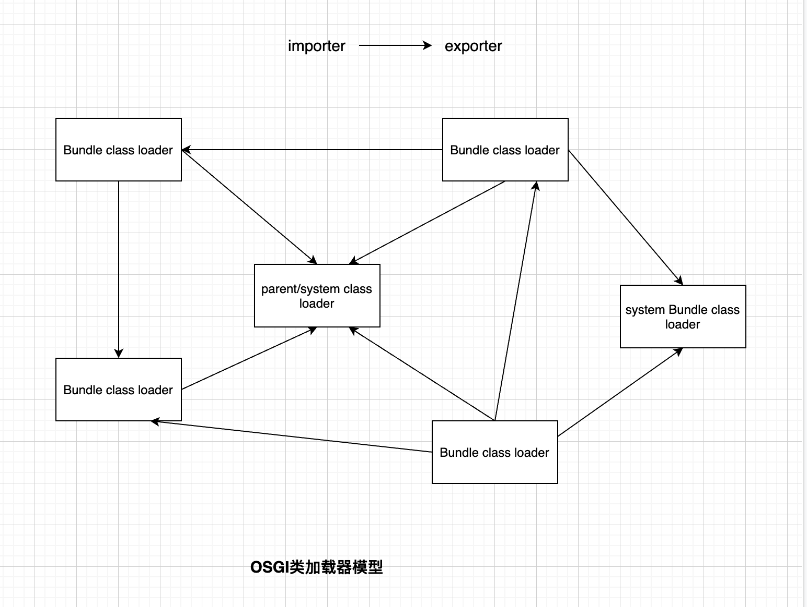

# 玩转类加载器

## 为什么需要类加载器
1. 可以使用类加载器来实现隔离。例如，当应用程序依赖一个 jar 包的两个不同版本时，可以使用两个类加载器分别加载这两个 jar 包。这样可以在同一个应用程序中同时使用两个不同版本的 jar 包，而无需手动配置。如果没有类加载器，实现这种使用方式将非常困难。
2. 实现动态加载。可以使用类的全路径名称和加载它的类加载器来唯一标识一个 Class 实例，如果需要动态加载类，我们可以在关联的类加载器基础上，重新创建一个新的类加载器来进行加载。这种方式非常便捷，可以轻松实现类的动态加载。

## 类加载器如何工作的
1. 查找类加载器:Java 虚拟机首先会查找默认的类加载器，通常是系统类加载器。如果默认的类加载器无法加载类，则 Java 虚拟机将尝试使用其他类加载器。
2. 加载类：一旦找到可用的类加载器，Java 虚拟机将使用该加载器来加载类。加载器会读取类的文件并将其转换为 Java 类对象。这个过程通常包括读取类文件、解析文件内容、构建类对象等步骤。
3. 链接类：一旦类被加载，Java 虚拟机将检查类是否已经链接。如果类已经链接，则 Java 虚拟机将把类加载器添加到链接器中，以便在未来可以重新链接该类。链接过程通常包括检查类的版本、链接类文件、计算类的依赖关系等步骤。
4. 初始化类：一旦类被链接，Java 虚拟机将开始初始化类。初始化包括执行类中的静态初始化器和静态变量赋值等操作。初始化完成后，Java 虚拟机可以将该类用于执行。
5. 使用类：一旦类被初始化，Java 虚拟机可以使用该类。此时，Java 虚拟机可以执行该类中的代码。

需要注意的是，类加载器不仅可以加载 Java 类，还可以加载其他类型的文件，如 .class 文件、.jar 文件等。因此，类加载器在 Java 应用程序中的加载和初始化是非常重要的。

## 常见的类加载器模型

### JDK类加载器


### tomcat类加载器


### OSGI类加载器


## 自定义类加载器

## 常见的类加载问题

1. Exception in thread "main" java.lang.ClassCastException: com.im.sky.javacore.classloader.Test2 cannot be cast to com.im.sky.javacore.classloader.Test2
	at com.im.sky.javacore.classloader.Test2.main(Test2.java:15)

```java
package com.im.sky.javacore.classloader;

public class Test2 {
    public static void main(String[] args) throws Exception {
        ClassLoader cl = Thread.currentThread().getContextClassLoader();
        while (cl != null) {
            System.out.println(cl.toString());
            System.out.println(cl.getClass().getClassLoader());
            cl = cl.getParent();
        }
        DefaultClassloader loader1 = new DefaultClassloader("/Users/jiangchangwei/jd_source/promotion/target/classes/");
        DefaultClassloader loader2 = new DefaultClassloader("/Users/jiangchangwei/jd_source/promotion/target/classes/");
        Class<?> cls = loader1.findClass("com.im.sky.javacore.classloader.Test2");
        Object o = cls.newInstance();
        Test2 test2 = (Test2)o;
        System.out.println(test2.getClass());
    }
}

// 自定义类加载器
public class DefaultClassloader extends ClassLoader {

    private String classPath;

    public DefaultClassloader(String classPath) {
        this.classPath = classPath;
    }

    public DefaultClassloader(String classPath, ClassLoader parent) {
        super(parent);
        this.classPath = classPath;
    }

    @Override
    protected Class<?> findClass(String name) throws ClassNotFoundException {
        byte[] classData = loadClassData(name);
        return this.defineClass(name, classData, 0, classData.length);
    }

    private byte[] loadClassData(String name) {
        name = name.replace(".", "/");
        ByteArrayOutputStream bao = new ByteArrayOutputStream();
        byte[] arr = new byte[1024];
        try {
            FileInputStream fis = new FileInputStream(new File(classPath + name + ".class"));
            int len;
            while((len = fis.read(arr)) != -1) {
                bao.write(arr, 0, len);
            }
        }catch (Exception e) {
            e.printStackTrace();
        }
        return bao.toByteArray();
    }
} 
```

2. Exception in thread "main" java.lang.LinkageError: loader constraint violation: when resolving field "man" the class loader (instance of com/im/sky/javacore/classloader/ExtClassLoader) of the referring class, com/im/sky/javacore/classloader/t1/ManHolder, and the class loader (instance of com/im/sky/javacore/classloader/ExtClassLoader) for the field's resolved type, com/im/sky/javacore/classloader/t1/Man, have different Class objects for that type
```java
public class ExtClassLoader extends URLClassLoader {

    private ExtClassLoader delegate;

    public ExtClassLoader(URL[] urls) {
        super(urls, null);
    }

    public void setDelegate(ExtClassLoader delegate) {
        this.delegate = delegate;
    }

    @Override
    protected Class<?> findClass(String name) throws ClassNotFoundException {
        return super.findClass(name);
    }

    @Override
    protected Class<?> loadClass(String name, boolean resolve) throws ClassNotFoundException {
        if(delegate != null) {
            return delegate.loadClass(name, resolve);
        }
        return super.loadClass(name, resolve);
    }
}

// test
private static void test2() throws Exception {
    URL url = new File("/Users/jiangchangwei/jd_source/promotion/target/classes").toURI().toURL();
    URL[] urls = new URL[]{url};
    ExtClassLoader ext0 = new ExtClassLoader(urls);
    ExtClassLoader ext1 = new ExtClassLoader(urls);
    Class<?> cls = ext0.loadClass("com.im.sky.javacore.classloader.t1.PeopleHolder");
    ext0.loadClass("com.im.sky.javacore.classloader.t1.Man");
    ext0.setDelegate(ext1);
    cls.newInstance();
} 
```

## Q&A
1. Class.forName("com.test.Test")、Test.class、 new Test()过程中加载Class的区别？
- Class.forName是通过寻找加载其调用者类的加载器加载当前类，当然入参也可以指定一个类加载器；
- Test.class、 new Test()都是通过其调用者类加载器加载当前类

## 参考文档
[类加载器基础](https://www.infoworld.com/article/2077260/learn-java-the-basics-of-java-class-loaders.html)  
[linkageError错误demo](https://docs.jboss.org/jbossas/docs/Server_Configuration_Guide/4/html/Class_Loading_and_Types_in_Java-LinkageErrors___Making_Sure_You_Are_Who_You_Say_You_Are.html)  
[osgi类加载机制](https://juejin.cn/post/6844903777871347719)  
[osgi参考文档](https://docs.osgi.org/specification/osgi.core/7.0.0/framework.module.html)  
[tomcat类加载器介绍](https://www.cnblogs.com/aspirant/p/8991830.html)  
[找不到主类解决方案](https://blog.csdn.net/gao_zhennan/article/details/112749742)  