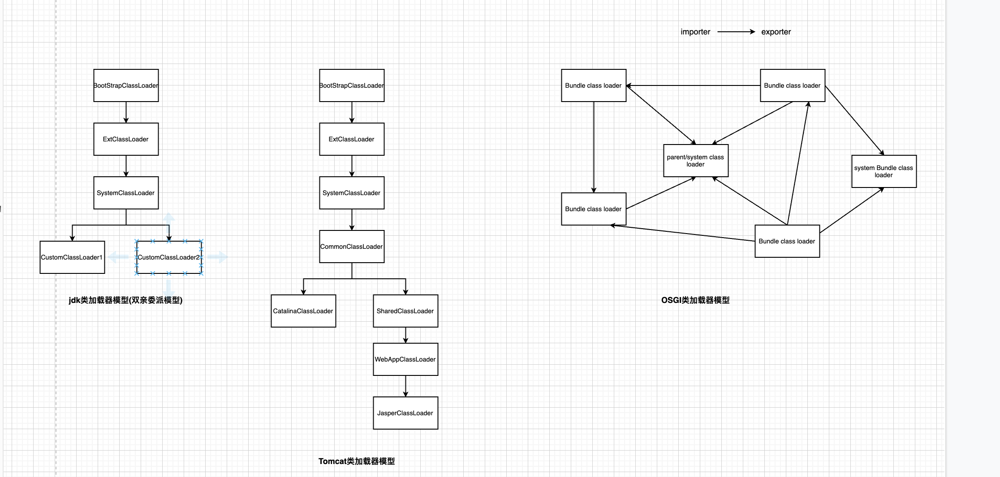

# 类加载运行过程常见错误分析

## 异常明细

### java.lang.ClassNotFoundException

#### 常见错误场景 

> 以下错误场景来源于网络  

1. 没有正确配置编译器：如果您正在使用编译器来编译 Java 文件，但您没有正确配置编译器，则可能会导致 ClassNotFoundException 异常。例如，如果您没有将所需的库文件夹添加到编译器的 "classpath" 中，则编译器将无法找到所需的类。

2. 类路径问题：类路径是指 Java 程序在运行时查找类的路径。如果类路径设置不正确，则可能会导致无法找到所需的类，从而导致 ClassNotFoundException 异常。例如，如果您将类路径设置为某个非 Java 目录，则程序将无法找到所需的类。

3. 没有加载类：如果您尝试访问一个类，但程序没有正确加载该类，则可能会导致 ClassNotFoundException 异常。例如，如果您尝试访问一个没有被正确加载的类，则程序将无法找到该类。

4. 资源问题：如果您尝试访问一个资源，但程序无法找到该资源，则可能会导致 ClassNotFoundException 异常。例如，如果您尝试访问一个图片资源，但程序无法找到该图片，则程序将无法加载该图片，从而导致 ClassNotFoundException 异常。

5. 打包问题：如果您在打包程序时出现了问题，例如打包的文件不完整或缺少必要的库，则可能会导致 ClassNotFoundException 异常。


#### 验证demo
```java
@Test
public void testClassNotFoundException() throws Exception {
    Assertions.assertThatThrownBy(()-> Class.forName("com.test.NoExistClass", false, ClassLoader.getSystemClassLoader()))
            .isInstanceOf(ClassNotFoundException.class);
} 
```


### java.lang.NoClassDefFoundError


#### 常见错误场景
如果Java虚拟机或者ClassLoader实例试图在类的定义中加载时，却找不到类的定义就会抛出这个异常，比如使用new关键字实例化一个对象时，或者显示调用一个方法时可能会触发这个异常；


#### 验证demo
```java
@Test
public void testNoClassDefFoundError() throws Exception {
    MyDIYClassLoader loader = new MyDIYClassLoader();
    Thread.currentThread().setContextClassLoader(loader);
    Class<?> cls = loader.loadClass("AAA");
    System.out.println(cls.getClassLoader());
    System.out.println(cls.newInstance());
    Assertions.assertThatThrownBy(() -> cls.getDeclaredMethod("getValue"))
            .isInstanceOf(NoClassDefFoundError.class);
}

private static class MyDIYClassLoader extends ClassLoader {

    @Override
    protected Class<?> findClass(String name) throws ClassNotFoundException {
        if("AAA".equals(name)) {
            return makeClass(name);
        }
        throw new ClassNotFoundException();
    }
}

private static Class<?> makeClass(String className) throws ClassNotFoundException {
    try {
        ClassPool cp = ClassPool.getDefault();
        CtClass bb = cp.makeClass("BB");
        CtClass ctClass = cp.makeClass(className);
        CtField ctField = new CtField(bb, "value", ctClass);
        ctClass.addField(ctField);
        CtMethod valueGetter = new CtMethod(bb, "getValue", new CtClass[]{}, ctClass);
        valueGetter.setModifiers(Modifier.PUBLIC);
        valueGetter.setBody("return this.value;");
        ctClass.addMethod(valueGetter);
        ctClass.writeFile("./");
        return ctClass.toClass();
    }catch (Exception e) {
        e.printStackTrace();
        throw new ClassNotFoundException();
    }
} 
```

## java.lang.LinkageError

### 常见错误场景
> 错误场景来自于网络

1. 动态链接库 (.jar 文件) 缺失或损坏：当试图加载一个缺失或损坏的动态链接库时，Java 虚拟机将抛出 LinkageError 错误。这通常会导致应用程序无法运行或崩溃。

2. 类加载器错误：当 Java 虚拟机试图加载一个类时，如果类加载器出现故障，可能会导致 LinkageError 错误。例如，如果类加载器无法找到所需的动态链接库或无法解析类文件，则会发生此错误。

3. 类加载器配置错误：如果类加载器的配置不正确，也可能导致 LinkageError 错误。例如，如果类加载器被设置为从不加载特定类，则可能会发生此错误。

4. 未知错误:Java 虚拟机在运行时遇到未知错误也可能导致 LinkageError 错误。
LinkageError 错误通常是由于类加载器无法正确加载类或动态链接库而导致的。因此，如果应用程序出现 LinkageError 错误，通常需要检查类加载器的配置和动态链接库的有效性。

**这个错误在热部署中遇到过，一个接口被两个类加载器进行了加载操作，在进行链接操作时就报了这样的错误**

### 验证demo
```java
@Test
public void testLinkageError() throws Exception {
    URL url = new File("/Users/jiangchangwei/jd_source/promotion/target/test-classes").toURI().toURL();
    DefaultClassLoader loader1 = new DefaultClassLoader(new URL[]{url});
    DefaultClassLoader loader2 = new DefaultClassLoader(new URL[]{url});
    Class<?> runClass = loader1.loadClass("com.im.sky.ExceptionTest$Run");
    loader1.loadClass("com.im.sky.ExceptionTest$A");
    loader1.setDelegate(loader2);
    Assertions.assertThatThrownBy(runClass::newInstance)
            .isInstanceOf(LinkageError.class);
}

public static class A {

}

public static class AHolder {
    public A a = new A();
}

public static class Run {

    public Run() {
        AHolder aHolder = new AHolder();
        A a = aHolder.a;
    }
}


public static class DefaultClassLoader extends URLClassLoader {

    DefaultClassLoader delegate;

    DefaultClassLoader(URL[] urls) {
        super(urls, null);
    }

    void setDelegate(DefaultClassLoader delegate) {
        this.delegate = delegate;
    }

    @Override
    protected Class<?> findClass(String name) throws ClassNotFoundException {
        return super.findClass(name);
    }

    @Override
    protected Class<?> loadClass(String name, boolean resolve) throws ClassNotFoundException {
        if(delegate != null) {
            return delegate.loadClass(name, resolve);
        }
        return super.loadClass(name, resolve);
    }
} 
```

## 分析
基于上述的错误场景，可以看出这些场景都是跟类加载器有所关联，像我们日常工作中经常使用spring框架，如果依赖了spring的不同的版本，在编译时可能没有什么问题，但是在运行时经常会遇到ClassNotFoundException这个异常，因为类加载器并不知道先加载哪一个类。比如类A有A1和A2两个版本，如果加载了A1版本，那A2版本就没法进行加载了，但如果我们依赖A2的版本，那启动就会报错。

目前大家比较熟悉jdk中类加载的双亲委派模型，但是这个也不是强约束的，我们自定义类加载就可以破坏这个约束，目前像tomcat、OSGI中类加载器就没有遵循这种结构，简单的双亲委派模型是一个简单的链式结构，像tomcat类加载器模型已经称之为树形结构了，而在OSCI中的类加载器模型已经是复杂的图结构了。



## 总结
对于这些经常遇到的错误，如果能够理解背后的原理，再次遇到相似的问题，解决起来事半功倍。对于一些有意思的东西，还是需要抱着去把玩的心态去学习，去研究，才能更快的在技术上成长。


