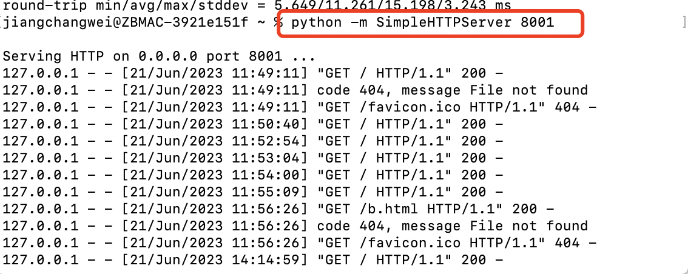
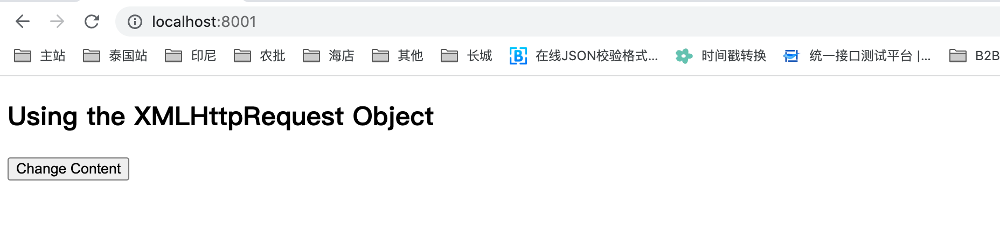
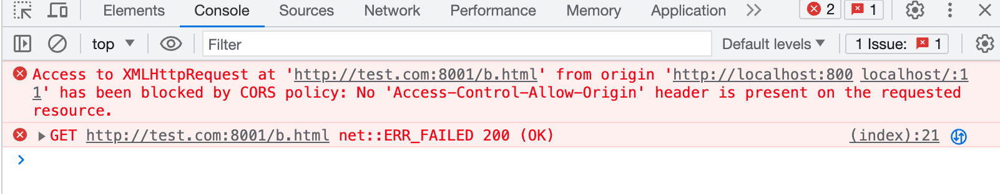

# 聊一下遇到的跨域问题和解决方案

## 前言
作为一个不经常跟前端开发打交道的后端开发者，最近在使用内部工具调用http接口时，出现了接口偶尔不可用的问题，通过浏览器的开发者工具，发现请求被CORS策略进行限制了，那为什么http接口时灵时不灵呢？带着这个疑问，从关键词CORS出发，对这块内容进行了一个研究，从而解决当前遇到的问题。

## 什么是CORS
CORS的全称是Cross-origin resource sharing，中文解释就是”跨域资源共享“。说到跨域，就需要先说说浏览器的同源策略，同源策略是浏览器最核心也是最基本的功能，如果缺少了同源策略，浏览器的安全和正常功能将受到影响。

那什么是同源呢？如果访问的两个资源的协议、域名、端口相同，则认为是同源，也就是所说的跨域的概念。如果进行跨域访问，会受到浏览器的同源策略限制（注：这个是浏览器的行为，需要特别注意），出现跨域请求时，请求会到达服务器，并且服务器也会返回结果，但是浏览器可能会拒收。

## 偶现的问题
我这边提供了封装了一个http接口，底层调了jsf的的泛化调用，之前倒是没遇到调用失败的问题，现在越发的频繁了，影响了使用体验，因此就决定解决这个问题。因为这个调用失败是偶现的，只能等着某一次调用失败来观察现象，打开开发者工具，可以看到错误信息如下：


从错误信息可以看出，我这边从http://im.加密访问http://im.加密/jsf/invoke_jsf请求被CORS策略限制了，但是按照前面的同源策略定义，这两个请求符合同源策略呀，为啥还会被限制呢？在这个报错中其实还有一个关键错误信息：”The reqeust client is not a secure context and the resource is in more-private address space private“，翻译过来就是请求客户端不是一个安全的上下文，资源位于更私有的地址空间。通过从网上搜索答案，原来在chrome的高版本中，chrome强制从公共网站访问私有内容使用https协议。

针对上述报错内容有两种解决方案，第一种将访问的资源改为https协议，第二种就是直接禁用chrome这一新特性，在浏览器输入chrome://flags，将”Block insecure private network requests“这一个选项改为disable。


**但还有一个未解决问题：为啥我这边报错是偶现的？如果大家知道原因可以分享一下。**


## 复现跨域问题 
前面聊到我这边遇到的问题不是传统上的同源策略的限制，既然研究到这了，那就继续研究下如果跨域了，现象是怎么样的？对于跨域问题如果解决的？

先来说说如何复现跨域问题的，首先需要启动一个http服务器，我这边用了python自带的一键式启动服务端语法，非常简单，命令如下：


启动之后，在当前目录下创建了一个index.html文件，内容直接从晚上粘过来的，稍微改动了一下：
```xml
!DOCTYPE html>
<html>
<body>

<h2>Using the XMLHttpRequest Object</h2>

<div id="demo">
<button type="button" onclick="loadXMLDoc()">Change Content</button>
</div>

<script>
function loadXMLDoc() {
  var xhttp = new XMLHttpRequest();
  xhttp.onreadystatechange = function() {
    if (this.readyState == 4 && this.status == 200) {
      document.getElementById("demo").innerHTML =
      this.responseText;
    }
  };
  xhttp.open("GET", "http://test.com:8001/b.html", true);
  xhttp.send();
}
</script>
```
在浏览器通过http://localhost:8001/index.html访问这个页面，然后点击”Change Content“这个按钮触发访问http://test.com:8001/b.html这个文件，文件内容随便写即可。test.com这个域名绑定的也是127.0.0.1，只是为了让localhost这个域名跟test.com不一样即可，从而破坏同源策略，现象如下：



从图中可看请求被CORS策略限制了，并提示了一个核心参数：Access-Control-Allow-Origin，这个参数可以在http response header设置，表示哪些跨域访问是允许的。

## 如何解决
那上述复现的同源策略问题如何解决呢？可以从两方面进行解决：浏览器关闭同源策略的限制或者服务端返回请求时告诉浏览器，我知道你是跨域访问，但是我信任你，你就接受我的返回结果吧。

### 浏览器方案
可以在启动chrome浏览器时，关闭浏览器限制，从网上搜到了一个命令行启动chrome浏览器的方式，验证有效：

open -n -a /Applications/Google\ Chrome.app/Contents/MacOS/Google\ Chrome --args --user-data-dir="/tmp/chrome_dev_test" --disable-web-security

### 服务端方案：
现在聊聊服务端方案，服务端只要告诉浏览器我信任你的跨域请求就行，目前在http response header中提供了很多的参数，通过其中的一些参数就能解决这个问题。参数说明如下：  
```
Access-Control-Allow-Origin:http://a.com // 表示接受a域名访问   
Access-Control-Allow-Credentials: true  // 是否允许后续请求携带认证信息(如:cookies),该值只能是true,否则不返回   
Access-Control-Max-Age: 1800 //预检结果缓存时间,也就是上面说到的缓存，单位：秒   
Access-Control-Allow-Methods:GET,POST,PUT,POST // 允许的请求动词, GET|POST|PUT|DELETE  
Access-Control-Allow-Headers:x-requested-with,content-type //允许的请求头字段      
```

在spring中，可以配置一个filter，可以进行如下配置，添加这些http response头字段
```java
@Component
@Order(1)
@WebFilter(urlPatterns = "/**")
@Slf4j
public class CORSFilter implements Filter {

    @Override
    public void init(FilterConfig filterConfig) throws ServletException {

    }

    @Override
    public void destroy() {

    }

    @Override
    public void doFilter(ServletRequest request, ServletResponse response, FilterChain chain) throws IOException, ServletException {
        HttpServletRequest httpServletRequest = (HttpServletRequest)request;
        HttpServletResponse httpServletResponse = (HttpServletResponse) response;
        String orign = httpServletRequest.getHeader("Origin");
//        if (log.isDebugEnabled()){
//            log.debug("拦截器，Origin是：{} ，request:{}",orign, JSONObject.toJSONString(request));
//        }
        if(Arrays.asList(GlobalConstants.ALLOW_HOSTS).contains(orign)) {
            httpServletResponse.setHeader("Access-Control-Allow-Origin", orign);
            httpServletResponse.setHeader("Access-Control-Allow-Methods", "*");
            httpServletResponse.setHeader("Access-Control-Allow-Credentials", "true");
            httpServletResponse.setHeader("Access-Control-Allow-Headers", "Content-Type,Accept,token,X-Requested-With");
            httpServletResponse.setHeader("Access-Control-Max-Age", "3600");
        }
        chain.doFilter(request, response);
    }
}
```

通过上述访问，能够完美避开浏览器CORS限制，如果为了临时验证，直接从浏览器层面处理就行，当然了，线上环境如果出现这个问题，还是得从服务端触发。

## 其他
1、nginx解决跨域问题  
nginx可以配置一个代理服务器做跳板机，反向代理访问服务端的域名，当浏览器访问A域名时，nginx可以将A域名代理转发到服务端真实的B域名，这样的话浏览器只能感知到访问A域名，这样就不存在跨域访问了，感觉欺骗了浏览器。。
```
# 前端nginx配置 
server {
    listen       8001;
    server_name  a.com;

    location / {
        proxy_pass   http://b.com;  #反向代理
        index  index.html index.htm;
    }
}     
```

## 总结
浏览器的同源策略是为了保证使用的安全性策略之一，其中还有各种其他策略，有的策略在浏览器就可以关闭，如果大家临时打开了，后面一定要关闭，防止访问不明网站是被窃取了密码的敏感数据。


## 信息汇总
1、浏览器报的错误信息
Access to XMLHttpRequest at 'http://im.加密/jsf/invoke_jsf' from origin 'http://im.加密' has been blocked by CORS policy: The request client is not a secure context and the resource is in more-private address space `private`.\

2、 正常请求的http header
**Request Headers:**

POST /jsf/invoke_jsf HTTP/1.1
Accept: */*
Accept-Encoding: gzip, deflate
Accept-Language: zh-CN,zh;q=0.9
Cache-Control: no-cache
Connection: keep-alive
Content-Length: 632
Content-Type: application/x-www-form-urlencoded; charset=UTF-8
Cookie: 加密
Host: im.加密
Origin: http://im.加密
Pragma: no-cache
Referer: http://im.加密/jsf/jsf_page
User-Agent: Mozilla/5.0 (Macintosh; Intel Mac OS X 10_15_7) AppleWebKit/537.36 (KHTML, like Gecko) Chrome/114.0.0.0 Safari/537.36

**Response Headers:**
HTTP/1.1 200 OK
Server: openresty
Date: Mon, 19 Jun 2023 03:20:23 GMT
Content-Type: application/json;charset=UTF-8
Transfer-Encoding: chunked
Vary: Accept-Encoding
Expires: Mon, 19 Jun 2023 03:20:23 GMT
Cache-Control: max-age=0
Content-Encoding: gzip

3、非正常请求的header
**request header**
Accept:
*/*
Content-Type:
application/x-www-form-urlencoded; charset=UTF-8
Referer:
http://im.加密/jsf/jsf_page
User-Agent:
Mozilla/5.0 (Macintosh; Intel Mac OS X 10_15_7) AppleWebKit/537.36 (KHTML, like Gecko) Chrome/114.0.0.0 Safari/537.36
X-Requested-With:
XMLHttpRequest

错误信息
jsf_page:1 Access to XMLHttpRequest at 'http://im.加密/jsf/invoke_jsf' from origin 'http://im.加密' has been blocked by CORS policy: The request client is not a secure context and the resource is in more-private address space `private`.
jquery.min.js:4     POST http://im.加密/jsf/invoke_jsf net::ERR_FAILED

4、关闭浏览器的安全
打开chrome://settings/security，将浏览器设置为不保护

5、关闭cors 这个起作用
open -n -a /Applications/Google\ Chrome.app/Contents/MacOS/Google\ Chrome --args --user-data-dir="/tmp/chrome_dev_test" --disable-web-security


## 参考文档
[http header信息明细](https://en.wikipedia.org/wiki/List_of_HTTP_header_fields)
[cors详解](https://www.ruanyifeng.com/blog/2016/04/cors.html)
[ngix解决跨域问题](https://liuyanqing.github.io/2017/09/29/about-nginx.html)
[浏览器同源策略](https://cloud.tencent.com/developer/article/1744586)
[禁用浏览器同源策略限制](https://juejin.cn/post/6844904078154137613)
[禁用同源策略](https://stackoverflow.com/questions/3102819/disable-same-origin-policy-in-chrome)
[禁用同源策略](https://stackoverflow.com/questions/57552185/how-to-disable-cors-in-chrome-mac)