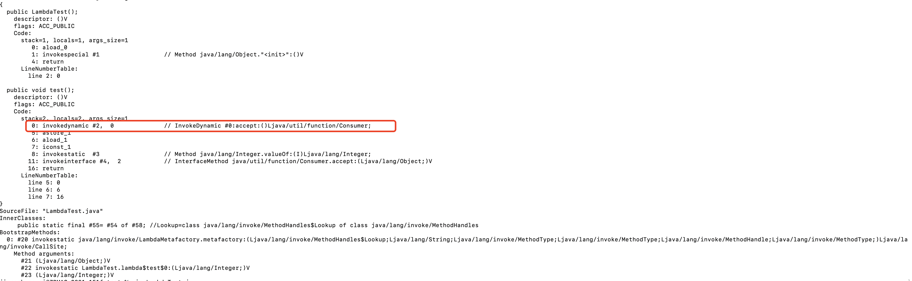
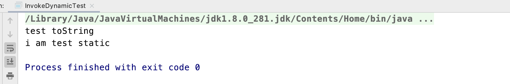

# 简单聊聊闭包这个概念和基本使用

## 起源
闭包的概念是在1960年代采用lambda演算的表达式的机器求值而开发的。基于维基百科的说法，在计算机科学中，闭包又称为词法闭包或函数闭包，是在支持头等函数的编程语言中实现词法绑定的一种技术。我们都听说过函数，函数是一个执行语句的集合体，而闭包在使用方面非常类似于函数，但有一个很大的区别是，闭包维护了一个关联的环境，而这个环境包含了一些约束变量（函数内部绑定的符号）、一些自由变量（在函数外部定义但在函数内部引用）。

## 名词解释

1. 头等函数（函数是一等公民）
如果函数作为一等公民，则函数可以作为其他函数入参和出参，同时也可以将函数赋值给一个变量。在js、python等脚本语言中函数体现的淋漓尽致，而在java中由于没有函数的概念，是通过lambda表达式实现类似的语义的。

2. 自由变量和约束变量
对于一个函数，它的入参和内部定义的变量称之为约束变量，受这个函数表达式的约束。在函数内部引用的函数外部定义的变量称之为自由变量。


## 为什么需要闭包
从“闭包”的字面意思感觉有点封闭的意思，那封闭了什么呢？主要是封闭了构建闭包时的环境，可以保证在定义闭包外的地方访问定义它时的作用域变量。这个作用域变量通常指的就是自由变量，这些自由变量在构建闭包时就已经确定了。这样能够保证数据封装和数据隔离，防止环境污染。

## java中lambda表达式底层原理
闭包在一些脚本语言，比如js、python中有很重的使用，因为java中没有函数的概念，但是lambda表达式的使用类似于闭包，下面从lambda表达式聊聊闭包的基本使用；

既然说到java中lambda表达式，咱们先来聊聊lambda诞生的背景。

在java8之前，如果我们要使用扩展实现，通常先定义一个接口，然后在使用的地方定义不同接口实现类，或者直接使用匿名内部类，但是这样会存在类的膨胀，并且代码非常不雅观，重复代码也非常多，为了解决这个问题，在java8中诞生了lambda表达式，同时出现了函数式接口（总算在java中看到函数这个词了。。）。

通过反编译下面的源码，看看字节码指令如果调用的。
```java
import java.util.function.*;
public class LambdaTest {

    public void test() {
        Consumer<Integer> c = t -> System.out.println(t);
        c.accept(1);
    }
}
```

通过javap反汇编得到的字节码指令如下：


从字节码可以看出，lambda表达式底层是通过invokedynamic这个指令来执行的。这个指令目标在于处理新型的方法分派，允许应用级别的代码确定执行哪一个方法调用，只有再调用要执行的时候，才会进行判断。这个指令我们基本使用不到，为了支持这个指令，在java中通过方法句柄的api进行体现，可以通过指定方法签名，来执行指定的方法，用例如下：
```java
import java.lang.invoke.MethodHandle;
import java.lang.invoke.MethodHandles;
import java.lang.invoke.MethodType;

/**
 * @author jiangchangwei
 * @program promotion
 * @description
 * @date 2023-06-16 16:24
 **/
public class InvokeDynamicTest {

    public static void main(String[] args) throws Throwable {
        MethodType mt = MethodType.methodType(String.class);
        MethodHandles.Lookup lk = MethodHandles.lookup();
        InvokeDynamicTest invokeDynamicTest = new InvokeDynamicTest();
        MethodHandle mh = lk.findVirtual(InvokeDynamicTest.class, "toString", mt);
        System.out.println(mh.invoke(invokeDynamicTest));

        mt = MethodType.methodType(void.class);
        mh = lk.findStatic(InvokeDynamicTest.class, "test", mt);
        mh.invoke();

    }

    @Override
    public String toString() {
        return "test toString";
    }

    public static void test() {
        System.out.println("i am test static");
    }
}
```
返回结果：


从上述例子可以看出，可以通过指定方法签名来决定调用哪个方法，这块也不继续深究了，感觉采用的这个技术跟反射很类似，下面聊聊采用lambda表达式的使用。

## 基本使用

## 实现调用环境封闭
举个栗子。我们的系统有不同的环境，可能会基于不同的环境执行不同的操作，我们可以基于lambda表达式构建不同环境的闭包，这个闭包会持有构建闭包的上下文环境信息，后面在延迟执行闭包函数时还是可以知道之前的环境信息的，参见如下代码：
```java
public interface Env {

    default String getEnv() {
        return null;
    }
}

public class ProdEnv implements Env {
    @Override
    public String getEnv() {
        return "prod";
    }
}

public class TestEnv implements Env {
    @Override
    public String getEnv() {
        return "test";
    }
}

public class Operator {

    private static Map<String, Consumer<Object>> map = new ConcurrentHashMap<>();

    /**
     * @param env
     */
    public static Consumer<Object> buildProcessFunction(Env env) {
        // 相当于自由变量，env也是自由变量
        int i = 0;
        return map.computeIfAbsent(env.getEnv(),
                k -> t -> System.out.println("我正在处理事情，所处的环境为：" + env.getEnv() + "，i:" + i));
    }
}

public class LazyGo {

    public static void main(String[] args) {
        Consumer<Object> consumer = Operator.buildProcessFunction(new ProdEnv());
        consumer.accept(null);
    }
}
```
在Operator类中会通过buildProcessFunction方法构建基于不同环境的执行器，在LazyGo这个类的后期的执行中，consumer中还是可以持有环境变量信息的，通过闭包实现了环境的封闭，不仅记录了环境的信息，通过隐藏了环境信息，保证对外不可见，类似java中private等修饰符的作用。

## 结论
闭包的技术在不同的语言中都有重要的使用，在使用层面，没有太多的技术难点，但是理解闭包自带一个运行环境很重要，不仅方便了我们调用，而且解决了维护复杂的外部状态的烦恼。

## 参考文档
[js闭包的理解](https://mp.weixin.qq.com/s/ocB1ZklY-gPEOCajtaryhw)
[js中谈闭包](https://juejin.cn/post/7084549768067678245)
[官方文档](https://developer.mozilla.org/en-US/docs/Web/JavaScript/Closures)
[维基百科](https://zh.wikipedia.org/wiki/%E9%97%AD%E5%8C%85_(%E8%AE%A1%E7%AE%97%E6%9C%BA%E7%A7%91%E5%AD%A6))
[自由变量和约束变量](https://zh.wikipedia.org/wiki/%E8%87%AA%E7%94%B1%E5%8F%98%E9%87%8F%E5%92%8C%E7%BA%A6%E6%9D%9F%E5%8F%98%E9%87%8F)
[升级了解java中的lambda表达式](https://juejin.cn/post/7031368690624888869)
[invokedynamic：java的秘密武器](infoq.cn/article/invokedynamic-javas-secret-weapon)